# AWS Auto Scaling & CI/CD for a 3-Tier Application

## Assignment Book

| | |
|---|---|
| **Student** | Joyanta Sarker Joy |
| **Course** | Mastering DevOps — Batch 13 |
| **Module** | 9 — AWS Auto Scaling & CI/CD for a 3-Tier Application |
| **AWS Region** | Asia Pacific (Mumbai) — `ap-south-1` |
| **Repository** | https://github.com/JsJoyBitopibd/-AWS-Auto-Scaling-CI-CD-for-3-Tier-Application-Part-1-Auto-Scaling-for-3-Tier-Applications |
| **Date** | 25 September 2026 |

### Contents

1. Overview and account constraints
2. Part 1 — Auto Scaling for a 3-Tier Application
3. How the servers talk to each other (with commands)
4. Part 2 — CI/CD Pipeline
5. Appendix — scripts

---

# 1. Overview

| | |
|---|---|
| **Student** | Joyanta Sarker Joy |
| **Course** | Mastering DevOps — Batch 13 |
| **Module** | 9 — AWS Auto Scaling & CI/CD |
| **AWS Region** | Asia Pacific (Mumbai) — `ap-south-1` |

## What this project does

**Part 1** converts a backend that ran on a single EC2 instance into a **highly available, auto-scaling, self-healing** 3-tier architecture: an Application Load Balancer in front, a fleet of backend servers managed by an Auto Scaling Group across two Availability Zones, and a MySQL database tier behind a locked-down firewall.

**Part 2** adds an automated **CI/CD pipeline** (Source → Build → Test → Deploy) that ships new versions of the backend to the auto-scaling fleet, proves that freshly launched servers configure themselves automatically, and finishes with a **Blue/Green deployment** plus a tested **rollback**.

## How Part 2 was built without IAM roles

The account cannot create IAM roles, which CodePipeline, CodeBuild and CodeDeploy all require. The pipeline therefore uses **GitHub Actions** (Source → Build → Test → Package → Release) and a **pull-based deployer** on every server (`scripts/deploy.sh`, run by a `systemd` timer every 60 s and at first boot). A `git push` reaches the whole fleet in under two minutes with no AWS credentials anywhere; new Auto Scaling instances fetch the current release before their first health check. Blue/Green is a second target group + Auto Scaling Group pinned to a *candidate* release, switched by the ALB listener. Details and evidence: [Part 2](part2-cicd.md).

## Architecture


Request flow: **① Browser → ALB (:80)** → **② ALB → healthy backend EC2 (:3000, health-checked on `/health`)** → **③ Backend → MySQL (:3306)**.

## Documentation (repository layout)

| Document | What it covers |
|---|---|
| [Part 1 — Auto Scaling for 3-Tier Applications](part1-auto-scaling.md) | VPC, security groups, database tier, Launch Template, Target Group, ALB, Auto Scaling Group, health checks, self-healing test, scaling policy + load test — with screenshots |
| [Part 2 — CI/CD Pipeline](part2-cicd.md) | Pipeline architecture, source/build/deploy stages, auto-deploy to new instances, Blue/Green deployment, rollback test — with screenshots |
| **[Assignment Book (PDF)](Bitopi_AWS_AutoScaling_CICD_Assignment.pdf)** | Everything below in one document for submission — cover, both parts, the communication guide, all screenshots |
| [How the servers talk to each other](how-servers-communicate.md) | Every network hop in the system explained in plain words, with the real commands used at each hop |

## Repository structure

```
.
├── README.md                     ← you are here
├── docs/                         ← the full write-ups (assignment documentation)
│   ├── part1-auto-scaling.md
│   ├── part2-cicd.md
│   └── how-servers-communicate.md
├── diagrams/                     ← architecture diagrams (PNG + editable SVG)
├── SS/                           ← evidence screenshots  (P1-xx = Part 1, P2-xx = Part 2)
├── app/                          ← the Node.js backend application
│   ├── app.js                    ←   serves  /  /health  /version , reads from MySQL
│   ├── package.json              ←   version here = release tag
│   └── test/health.test.js       ←   tests run by the pipeline
└── scripts/                      ← EC2 user-data (first-boot) scripts
    ├── db-server-userdata.sh              ←   builds the MySQL database server
    ├── app-server-userdata.sh             ←   Launch Template v1 (Part 1: app embedded)
    ├── app-server-userdata-v2-blue.sh     ←   Launch Template v2 (Part 2: pull-based deployer, BLUE)
    ├── app-server-userdata-v3-green.sh    ←   Launch Template v3 (Blue/Green: GREEN, pinned candidate)
    ├── deploy.sh                          ←   the deployer that runs on every server
    └── fix-ssh-key-permissions-windows.ps1 ←   makes a .pem key usable by Windows OpenSSH
├── .github/workflows/ci-cd.yml   ← the CI/CD pipeline (GitHub Actions)
```

## Account constraints and how the design adapts

This project was built in a **restricted course account**. The limits below are real, and the design works around every one of them:

| Restriction | Impact | How we adapted |
|---|---|---|
| Cannot create **IAM roles** | Native CodeDeploy/CodeBuild/CodePipeline need service roles + an EC2 instance profile | Part 1 needs no user-created roles at all. Part 2 uses existing roles if present, otherwise a role-free pipeline (see Part 2 doc) |
| No **SSM** permission | Can't use Session Manager or Parameter Store | SSH with a key pair for access; environment variables for app config |
| Cannot create **RDS** (`rds:CreateDBSubnetGroup` denied) | No managed database | MySQL (MariaDB) self-hosted on a small EC2, auto-configured by user-data, protected by `bitopi-db-sg` |
| No **CloudShell** | Can't run AWS CLI in the console | All configuration done through the console; permissions confirmed by building |

> **Note on secrets:** the database password in the scripts is a throw-away lab credential and every resource is destroyed at the end of the assignment. In production this would live in AWS Secrets Manager, never in plain config.

## Progress

- [x] Part 1 architecture diagram
- [x] VPC + subnets across 2 AZs
- [x] Security groups (ALB / Backend / DB)
- [x] Database tier (MySQL on EC2)
- [x] Launch Template
- [x] Target Group + Application Load Balancer
- [x] Auto Scaling Group
- [x] Health checks + self-healing test
- [x] Scaling policy + load test (scale-out / scale-in)
- [x] Part 2 CI/CD architecture diagram
- [x] CI/CD pipeline (Source → Build → Deploy)
- [x] Auto-deploy to new Auto Scaling instances
- [~] Blue/Green deployment + rollback — **designed and prepared** (LT v3 user-data, candidate release path, runbook in the Part 2 doc §7); live switch + rollback pending a rebuilt stack


---

# 2. Part 1 — Auto Scaling for a 3-Tier Application

**Student:** Joyanta Sarker Joy · **Course:** Mastering DevOps, Batch 13 · **Region:** Asia Pacific (Mumbai) `ap-south-1`

## 1. Objective

Take a backend that runs on **one** EC2 instance — one server, one point of failure — and turn it into a **highly available, auto-scaling, self-healing** 3-tier architecture. When a server dies, a new one replaces it automatically. When traffic rises, more servers appear. When it falls, they go away. No human has to touch anything.

## 2. Architecture


### The three tiers

| Tier | What it is | Built with |
|---|---|---|
| **Tier 1 — Presentation / Edge** | The public front door. The only thing the internet can reach. | Application Load Balancer `bitopi-alb` |
| **Tier 2 — Application (Backend)** | The servers that run the code. **This is the tier that auto-scales.** | Auto Scaling Group `bitopi-app-asg` of EC2 instances running a Node.js app on port 3000 |
| **Tier 3 — Data** | The database every backend server reads from and writes to. | MySQL (MariaDB) on EC2 `bitopi-db-server` |

### How a request travels

1. **Browser → ALB** on port **80**. The ALB's DNS name is the one public address for the whole system.
2. **ALB → a healthy backend EC2** on port **3000**. The ALB only chooses servers that pass its health check (`GET /health` → `200`).
3. **Backend EC2 → MySQL** on port **3306**, using the database server's private IP `10.0.13.216`.
4. The answer travels back along the same path.

### Why two Availability Zones

An Availability Zone is a physically separate data centre. Every layer here exists in **both** `ap-south-1a` and `ap-south-1b`: the ALB has a node in each, the Auto Scaling Group spreads instances across both, and the subnets are paired. If one data centre has a problem, the other keeps serving. That is what "highly available" means in practice.

## 3. Design decisions and account constraints

This was built in a **restricted course account**. Three limits shaped the design, and the write-up is honest about each one.

| Constraint | What it blocked | What we did instead |
|---|---|---|
| Cannot create **RDS** resources (`rds:CreateDBSubnetGroup` denied) | A managed database | Installed MySQL (MariaDB 10.5) on a `t3.micro` EC2, fully auto-configured by a first-boot script. Same port, same firewall rule, same app code — the app cannot tell the difference. |
| No **IAM role** creation, no **SSM** | Session Manager, Parameter Store, instance profiles | SSH with a key pair for access; the app reads its config from environment variables written at boot. |
| No **CloudShell** | AWS CLI in the browser | Everything was done in the console; permissions were confirmed by building. |

Two deliberate cost/complexity choices:

- **No NAT Gateway.** A NAT Gateway costs ~US$32/month. Instead the backend and database servers sit in the **public** subnets with a public IP (so they can download packages), while the **security groups** guarantee that nothing on the internet can reach the app port or the database port. The two private subnets exist and are the correct home for the data tier in production (with RDS, or with a NAT Gateway / VPC endpoints for outbound access).
- **MySQL on one EC2, not Multi-AZ.** Adequate for the lab; in production this would be RDS Multi-AZ with a standby in the second AZ, as drawn on the diagram.

## 4. Build steps

Each step lists **what** was created, **why** it exists, **when you would use it**, the exact settings, and the evidence screenshot.

---

### Step 1 — VPC and subnets

**What:** a private network `bitopi-vpc` (`10.0.0.0/16`) with two public and two private subnets across two AZs, an Internet Gateway, and route tables.

**Why:** everything else lives inside this network. Public subnets have a route to the Internet Gateway; private subnets do not — that is the only difference, and it is what makes a subnet "public" or "private".

**When you'd use it:** every AWS workload that is not a throw-away test starts with its own VPC. Never build production on the default VPC.

| Setting | Value |
|---|---|
| Method | VPC console → *Create VPC* → **"VPC and more"** |
| Name prefix | `bitopi` |
| IPv4 CIDR | `10.0.0.0/16` |
| Availability Zones | 2 — `ap-south-1a`, `ap-south-1b` |
| Public subnets | `bitopi-subnet-public1-ap-south-1a` `10.0.0.0/20` · `bitopi-subnet-public2-ap-south-1b` `10.0.16.0/20` |
| Private subnets | `bitopi-subnet-private1-ap-south-1a` `10.0.128.0/20` · `bitopi-subnet-private2-ap-south-1b` `10.0.144.0/20` |
| NAT gateways | **None** (cost) |
| DNS hostnames / resolution | Enabled |
| Auto-assign public IPv4 | **Enabled on both public subnets** (so Auto Scaling instances get a public IP for package downloads) |

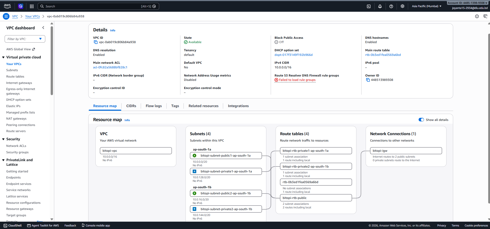

*Resource map: one VPC, four subnets, one public route table shared by both public subnets (with a route to `bitopi-igw`), one private route table per private subnet (no internet route).*

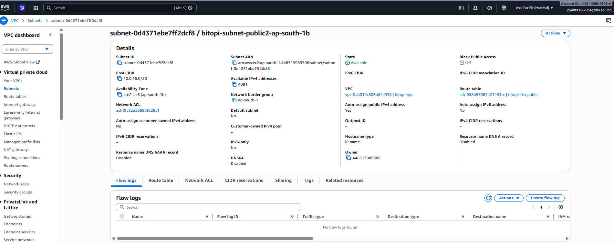

---

### Step 2 — Security groups (the firewalls)

**What:** three security groups, one per tier. Each one only trusts the tier directly in front of it.

**Why:** this is *defence in depth*. Even though the backend and database servers have public IPs, the firewall rules mean the only thing that can reach port 3000 is the load balancer, and the only thing that can reach port 3306 is a backend server. The rules reference **other security groups**, not IP addresses — so they keep working no matter how many instances the Auto Scaling Group launches or replaces.

**When you'd use it:** always. Chaining security groups by reference is the standard AWS pattern for multi-tier apps.

| Security group | ID | Inbound rules |
|---|---|---|
| `bitopi-alb-sg` | `sg-04c8272fbeeb0e769` | HTTP 80 from `0.0.0.0/0` · HTTPS 443 from `0.0.0.0/0` |
| `bitopi-backend-sg` | `sg-0029472c273fdd274` | **TCP 3000 from `bitopi-alb-sg`** · SSH 22 from admin |
| `bitopi-db-sg` | `sg-01883e3876cbf420d` | **MySQL 3306 from `bitopi-backend-sg`** · SSH 22 from admin |

Outbound on all three: default (all traffic). Security groups are **stateful**: when the backend opens a connection *into* the database, the reply is automatically allowed back out, so only inbound rules need to be written.

> **A note on SSH.** The SSH rules were left at `0.0.0.0/0` because the admin's public IP changes between networks and a "My IP" rule locked him out. Access still requires the `bitopi-key.pem` private key, so password-guessing is impossible. In production, SSH would be restricted to a bastion host or replaced with SSM Session Manager (not available in this account).

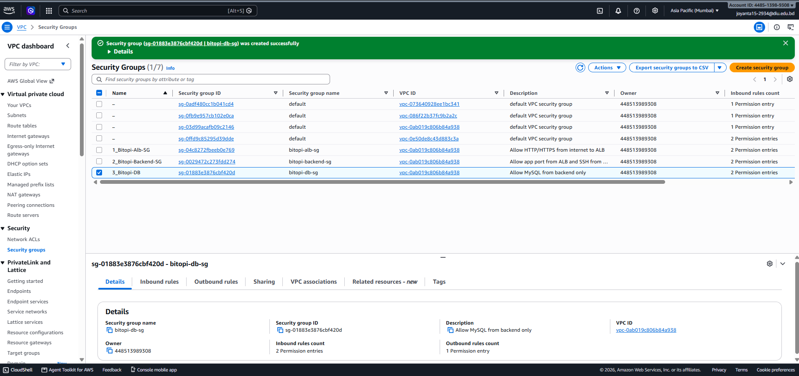
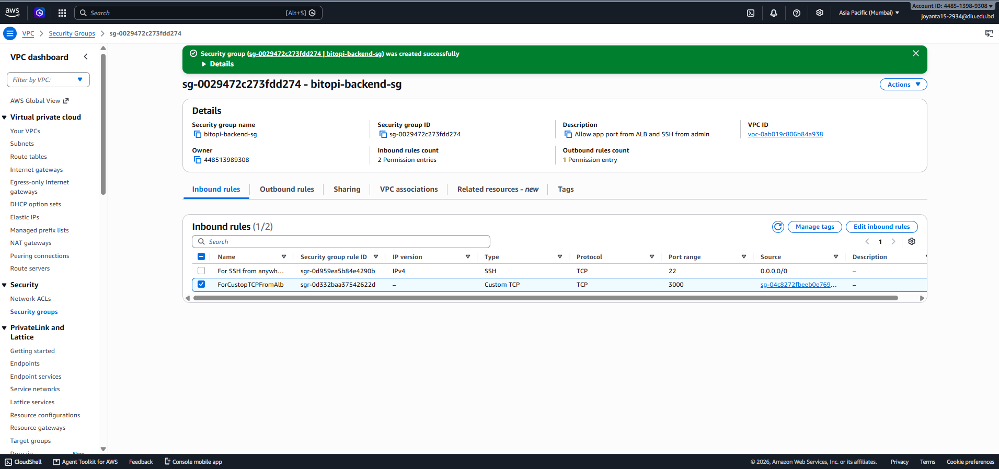
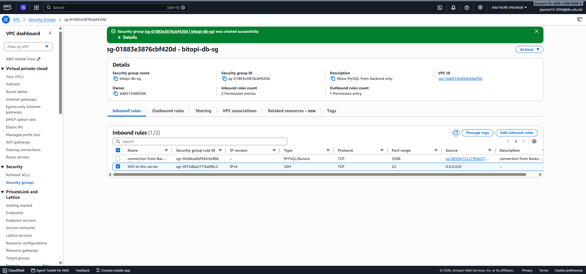

---

### Step 3 — Database tier (MySQL on EC2)

**What:** one `t3.micro` running Amazon Linux 2023. Its first-boot **user-data** script installs MariaDB, makes it listen on the network, creates the `appdb` database and an `appuser` account, and seeds two tables. Nobody ever logged in to set it up.

**Why:** the app needs a shared place to keep data. Every backend server — however many the Auto Scaling Group creates — connects to this one database, so all of them see the same data.

**When you'd use it:** self-hosting a database on EC2 is what you do when a managed service is unavailable (as here) or when you need something RDS doesn't offer. Otherwise, use RDS.

| Setting | Value |
|---|---|
| Name / ID | `bitopi-db-server` / `i-0496778ef511974dd` |
| AMI · type | Amazon Linux 2023 · `t3.micro` |
| Subnet | `bitopi-subnet-public1-ap-south-1a` (public IP enabled for package install) |
| Security group | `bitopi-db-sg` |
| Key pair | `bitopi-key` |
| **Private IP** | **`10.0.13.216`** — this is what the app connects to |
| Public IP | `13.233.34.184` (admin SSH only) |
| User-data | [`scripts/db-server-userdata.sh`](../scripts/db-server-userdata.sh) |

The script, in plain words:

```bash
dnf install -y mariadb105-server          # install MySQL-compatible server
systemctl enable --now mariadb            # start it now and on every boot
# make it listen on all interfaces (not just localhost)
printf '[mysqld]\nbind-address=0.0.0.0\n' > /etc/my.cnf.d/99-app.cnf
systemctl restart mariadb
mysql <<'SQL'                              # create database, user, tables, seed row
CREATE DATABASE IF NOT EXISTS appdb;
CREATE USER IF NOT EXISTS 'appuser'@'%' IDENTIFIED BY '...';
GRANT ALL PRIVILEGES ON appdb.* TO 'appuser'@'%';
...
SQL
```

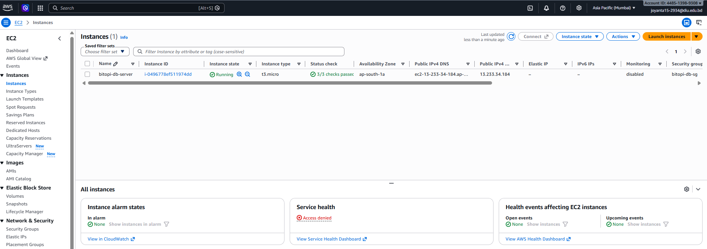
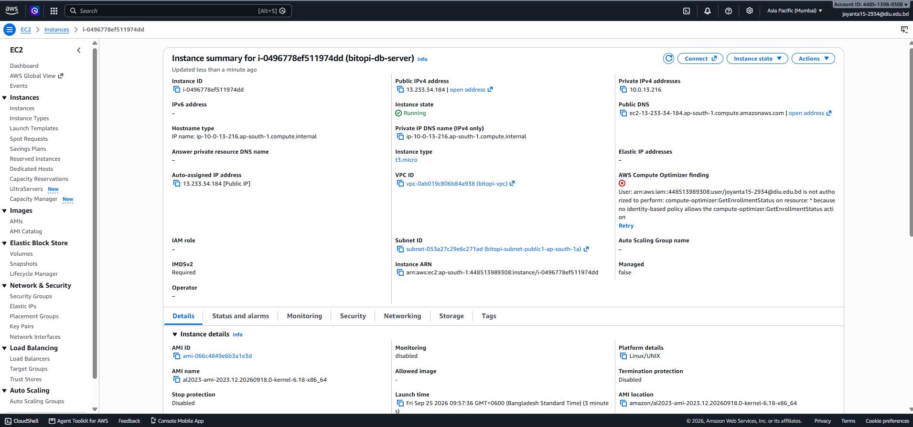

---

### Step 4 — Launch Template (the recipe for every app server)

**What:** `bitopi-app-lt` — a saved blueprint that says exactly how to build one backend server: which OS image, which size, which key, which firewall, and a first-boot script that installs and starts the app.

**Why:** the Auto Scaling Group must be able to create servers **without a human**. It can only do that if it has a recipe. Every instance stamped from this template is identical.

**When you'd use it:** any time more than one copy of a server will ever exist — Auto Scaling Groups, spot fleets, or simply "launch another one exactly like the last one".

| Setting | Value |
|---|---|
| Name / ID | `bitopi-app-lt` / `lt-072cb16544d51e361` (v1) |
| AMI · type | Amazon Linux 2023 (`ami-066c4849e6b3a1e3d`) · `t3.micro` |
| Key pair | `bitopi-key` |
| Security group | `bitopi-backend-sg` |
| Subnet | **not included** — the ASG decides, so it can spread across AZs |
| User-data | [`scripts/app-server-userdata.sh`](../scripts/app-server-userdata.sh) |

What the user-data does on every new server, in order:

1. `dnf install -y nodejs` — install Node.js.
2. Ask the **instance metadata service** for its own instance-ID and AZ (IMDSv2: get a token, then query `169.254.169.254`).
3. Write `/opt/app/app.js` and `package.json` ([`app/`](../app/)).
4. Write `/opt/app/.env` with `PORT=3000`, its instance-ID and AZ, and the database connection (`DB_HOST=10.0.13.216`, `appuser`, `appdb`, `3306`).
5. `npm install` — fetch `express` and `mysql2`.
6. Register a **systemd service** `bitopi-app` so the app starts on boot and restarts if it crashes.

The app itself ([`app/app.js`](../app/app.js)) serves two routes:

- `GET /health` → `200 {"status":"healthy", ...}`. **Deliberately shallow** — it only proves the process is alive. It does *not* touch the database, so a brief DB blip cannot make the load balancer mark the whole fleet unhealthy.
- `GET /` → an HTML page showing which instance answered, its AZ, whether the database is reachable, the seed row read from MySQL, and a visit counter that *writes* a row to MySQL on every load. One page proves all three tiers are talking.

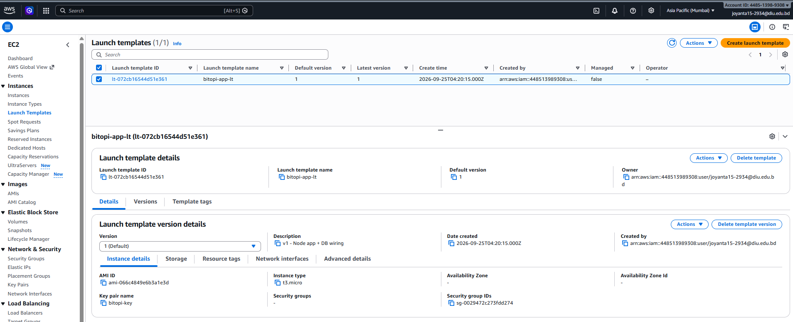

---

### Step 5 — Target Group and Application Load Balancer

**What:** the Target Group `bitopi-app-tg` is the ALB's *list of servers* plus the *health-check rule*. The ALB `bitopi-alb` is the public entry point that listens on port 80 and forwards to that group.

**Why:** users need **one** stable address while the servers behind it come and go. The ALB provides it, spreads traffic across every healthy server, and quietly stops sending traffic to any server that fails its health check.

**When you'd use it:** any web application with more than one server, or any application that must survive a server failure without users noticing.

| Target group `bitopi-app-tg` | |
|---|---|
| Target type · protocol : port | Instances · **HTTP : 3000** |
| VPC | `bitopi-vpc` |
| Health check | **HTTP `GET /health`**, success code `200` |
| Interval · timeout | 15 s · 5 s |
| Healthy · unhealthy threshold | 2 · 2 (so a server flips state after 30 s of consistent results) |
| Registered targets at creation | none — the ASG registers them |

| Load balancer `bitopi-alb` | |
|---|---|
| Type · scheme | Application · **Internet-facing** |
| Subnets | both **public** subnets (one node per AZ) |
| Security group | `bitopi-alb-sg` |
| Listener | **HTTP : 80 → forward to `bitopi-app-tg`** |
| DNS name | `bitopi-alb-1957667478.ap-south-1.elb.amazonaws.com` |

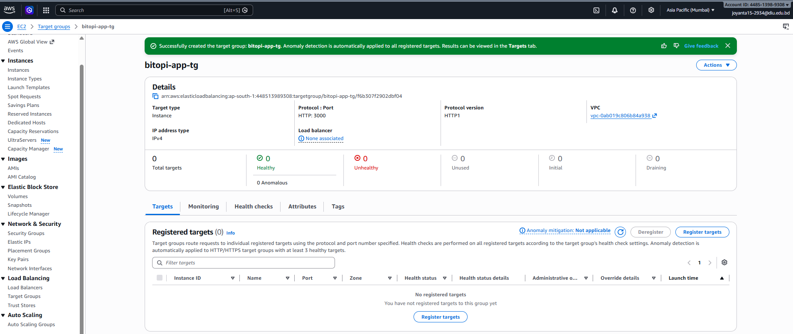
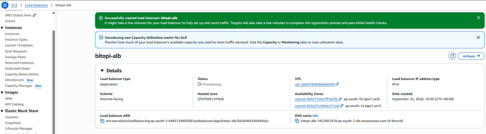
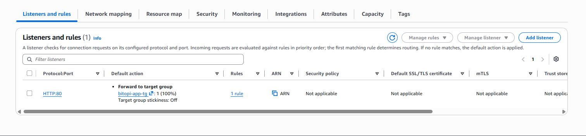

---

### Step 6 — Auto Scaling Group

**What:** `bitopi-app-asg` — the manager. It keeps the number of running app servers between **min 2** and **max 4**, launches them from the Launch Template into both public subnets, registers each one with the Target Group, and replaces any that become unhealthy.

**Why:** this single component delivers all three assignment goals. **High availability** — two servers in two AZs. **Self-healing** — it watches health and replaces failures. **Auto scaling** — with a policy attached (Step 8) it adds and removes servers on demand.

**When you'd use it:** whenever a stateless service needs to stay up and cope with variable load. Web/API backends are the classic case.

| Setting | Value |
|---|---|
| Launch template | `bitopi-app-lt`, version *Latest* |
| Subnets | `bitopi-subnet-public1-ap-south-1a` + `bitopi-subnet-public2-ap-south-1b` |
| Load balancing | attached to target group `bitopi-app-tg` |
| Health checks | EC2 **and** **Elastic Load Balancing** (so a failed `/health` counts as unhealthy, not just a stopped VM) |
| Health check grace period | 300 s — a new server gets 5 minutes to install Node and start before its health is judged |
| Capacity | **min 2 · desired 2 · max 4** |
| Tag | `Name = bitopi-app-server` (propagated to every instance) |

**Result:** two instances launched, one per AZ, and both passed the health check within ~4 minutes. Opening the ALB's DNS name in a browser served the app page with **Database: CONNECTED** — browser → ALB → EC2 → MySQL, all working. Refreshing the page shows different instance IDs as the ALB rotates between servers.

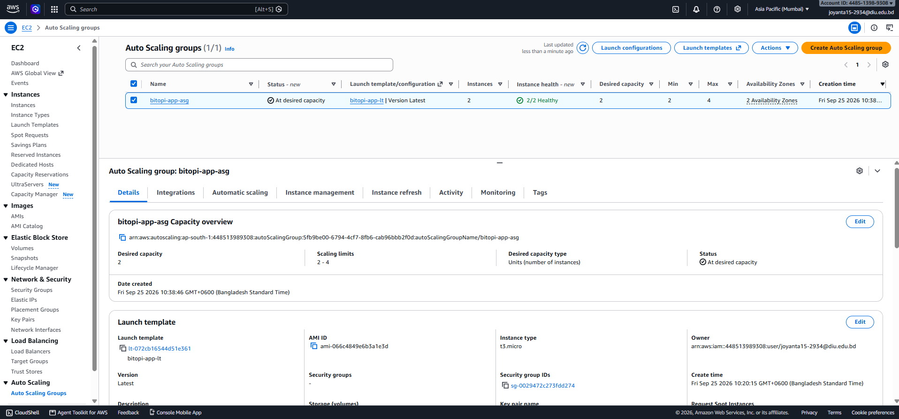
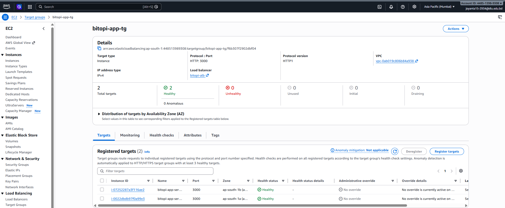
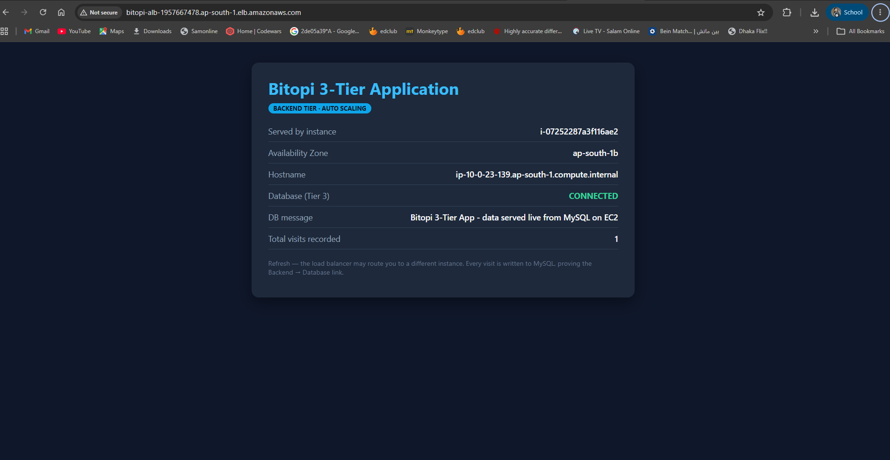

---

### Step 7 — Self-healing test

**Test:** with two healthy instances running, one (`i-0022dbdb97f0a99e3`, in `ap-south-1a`) was **terminated by hand** from the EC2 console — simulating a hardware failure or a crashed server.

**What happened, from the ASG activity log:**

| Time (UTC+6) | Event |
|---|---|
| 11:03:08 | *"Terminating EC2 instance i-0022dbdb97f0a99e3 … taken out of service in response to an EC2 health check … Waiting For ELB Connection Draining"* |
| **11:03:10** | *"Launching a new EC2 instance **i-0b762fab68c3abe53** … in response to an unhealthy instance needing to be replaced"* |
| ~11:06 | Target group back to **2 healthy** — the replacement placed in `ap-south-1a`, restoring the AZ balance |

**Two seconds** from detection to replacement. During the rebuild the app URL kept working, served by the surviving instance in `ap-south-1b` — **zero downtime**. The replacement has a **different instance ID**: it is a brand-new server built from the Launch Template, not a restart.

*Connection draining* means the ALB let in-flight requests to the dying server finish before cutting it off.

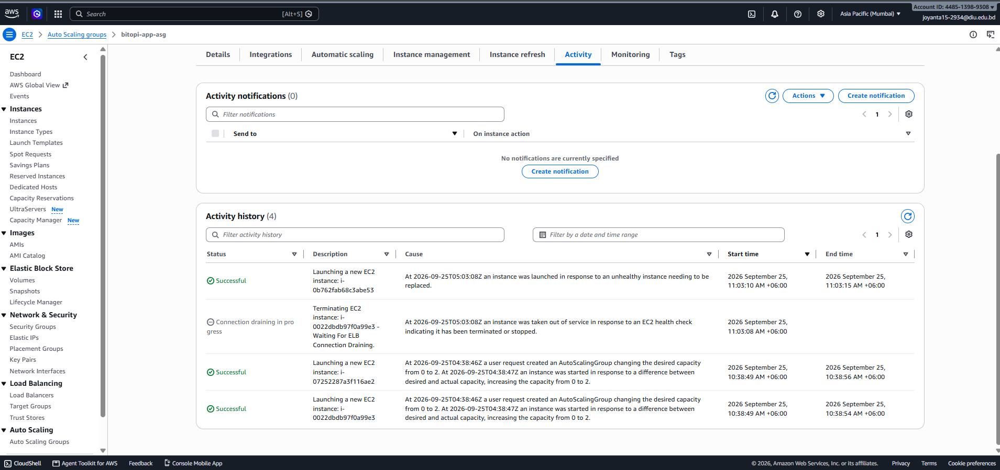
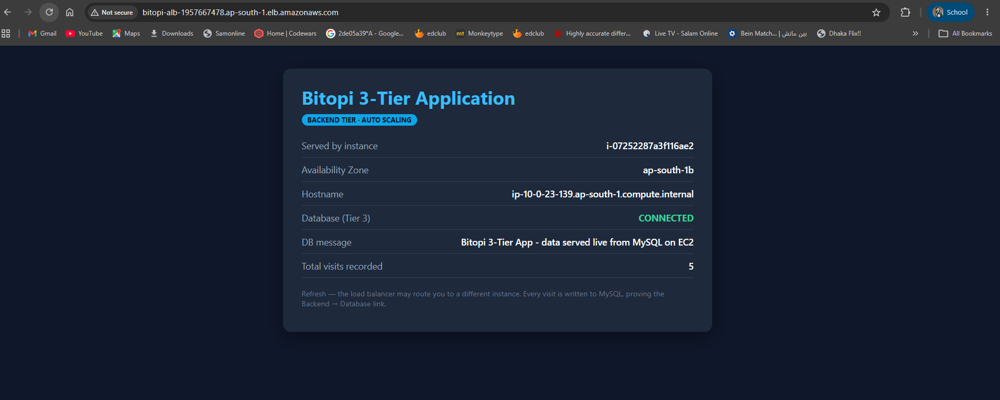
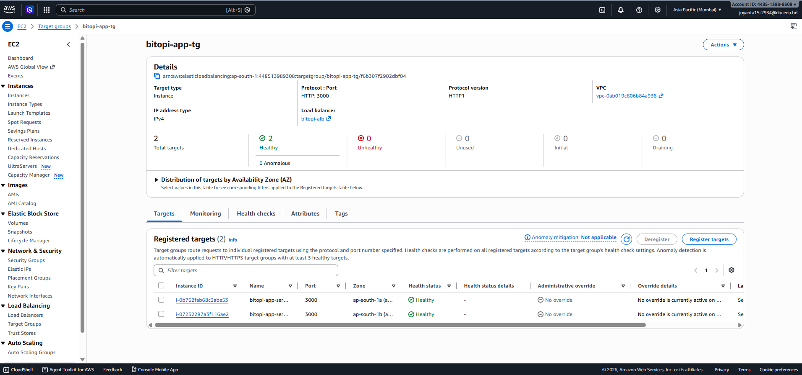

---

### Step 8 — Scaling policy and load test

**Policy:** `bitopi-cpu-target-tracking` — **Target tracking** on **Average CPU utilization = 30%**, instance warm-up 60 s, scale-in enabled.

**Why target tracking:** you give it one number and AWS derives everything else — it creates two CloudWatch alarms (`AlarmHigh`, `AlarmLow`) and works out how many instances keep the average near the target. It is the *thermostat* model. The alternative, **step scaling**, makes you write the rules yourself ("if CPU > 60% add 1; if > 80% add 2"). Target tracking is the recommended default for web backends.

**How the maths works** (this predicted the result exactly):

> desired = ceil( current instances × current metric ÷ target )
> = ceil( 2 × 50% ÷ 30% ) = ceil(3.33) = **4**

**Load generation:** SSH into a backend instance and pin every CPU core with a dependency-free loop that stops itself after 15 minutes:

```bash
for i in $(seq 1 $(nproc)); do timeout 900 bash -c 'while :; do :; done' & done
top -bn1 | head -5        # showed: 86.1 us, 13.9 sy, 0.0 id  → 100% busy
```

Stop early with `pkill -f "timeout 900"`.

**Scale-out**, from the activity log:

| Time | Event |
|---|---|
| ~11:27 | Load started on `i-07252287a3f116ae2` (`ip-10-0-23-139`) — 0.0% idle |
| **11:34:42** | *"monitor alarm TargetTracking-…-AlarmHigh in state ALARM triggered policy bitopi-cpu-target-tracking changing the desired capacity from 2 to 4"* — launched `i-0f33782fbae77fa57` and `i-0791db15f912ef398` |
| 11:35:47 | **4 instances InService, all Healthy**, two per AZ |

**Scale-in** (load stopped ~11:45; target tracking waits ~15 minutes of sustained low CPU before removing anything, to prevent "flapping"):

| Time | Event |
|---|---|
| **12:01:20** | *"AlarmLow in state ALARM … changing the desired capacity from 4 to 3"* — `i-07252287a3f116ae2` selected, connection draining |
| **12:01:40** | *"… from 3 to 2"* — `i-0b762fab68c3abe53` selected, connection draining |
| 12:04 | Desired 2; one instance left in **each** AZ (the ASG removed one from each zone, keeping the balance) |

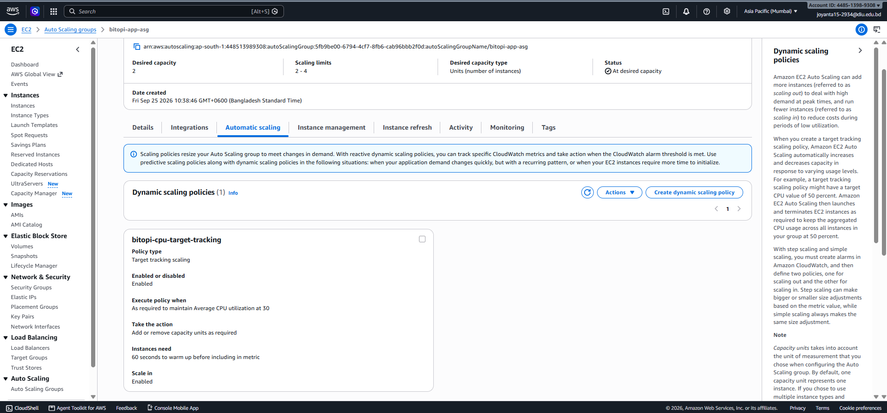
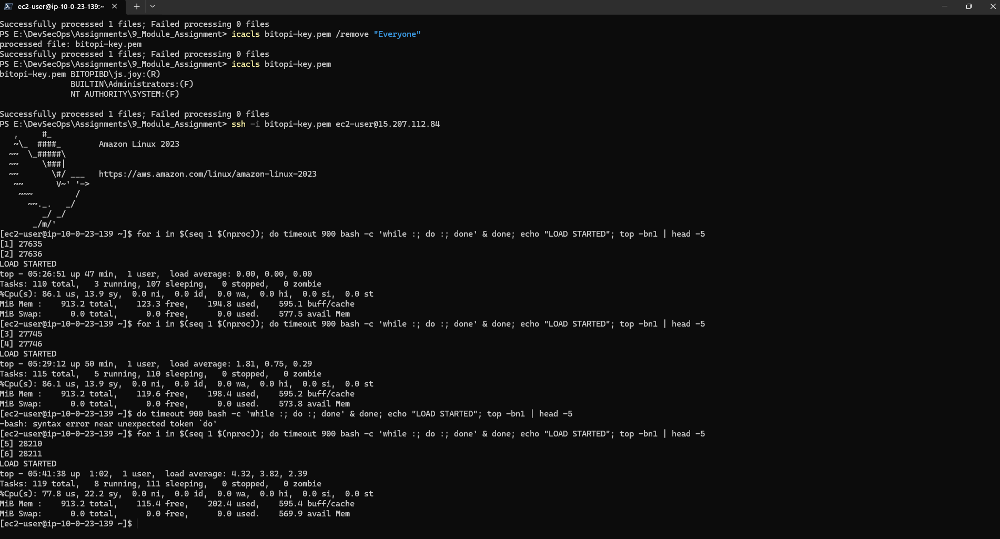
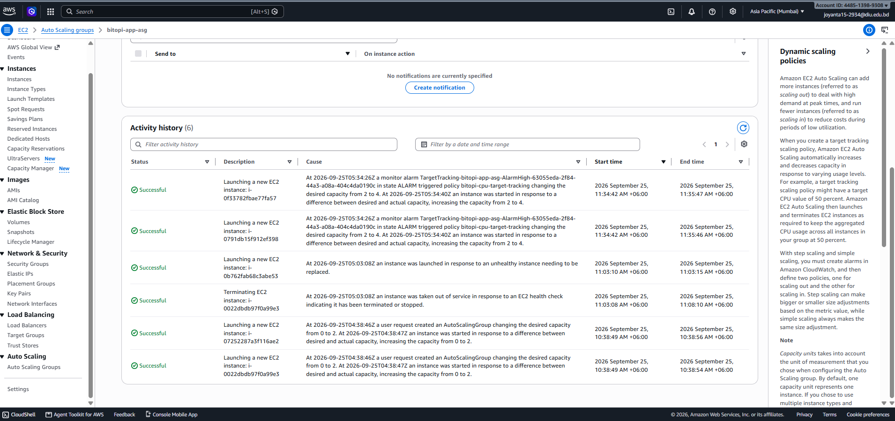
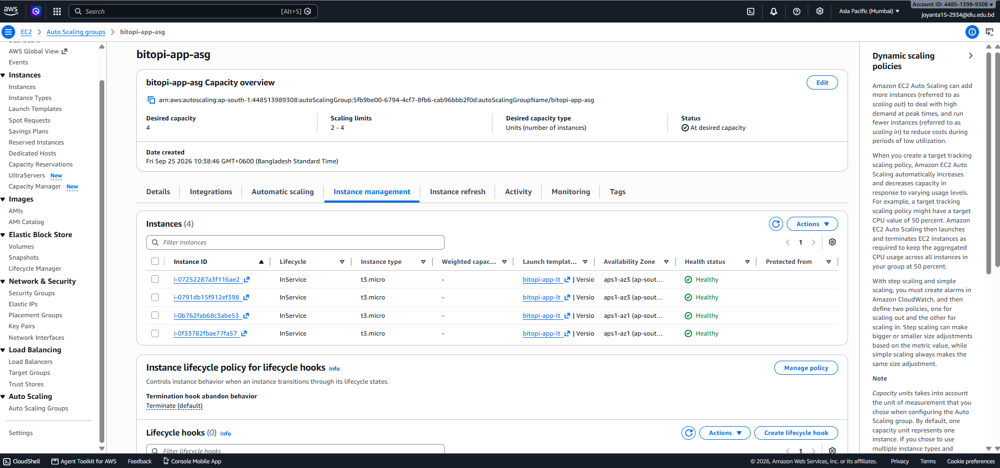
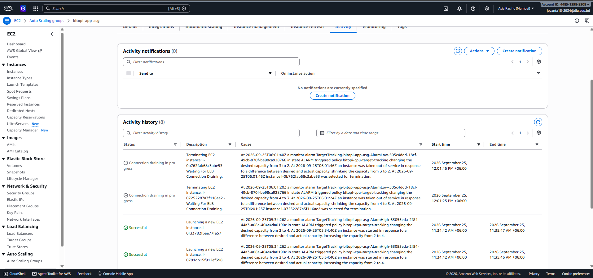
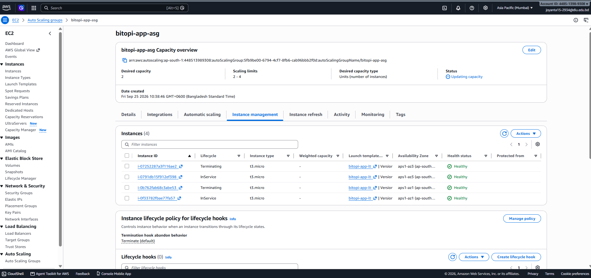

## 5. Health checks — the two layers explained

There are two different health checks and they do different jobs.

| | ALB / Target Group health check | Auto Scaling Group health check |
|---|---|---|
| **Question it asks** | "Should I send this server traffic *right now*?" | "Should this server be *replaced*?" |
| **How** | `GET /health` every 15 s; 2 consecutive failures → *unhealthy* | EC2 status checks **plus** the ELB result (we turned this on) |
| **Consequence** | Server is taken out of rotation; traffic goes to the others | Server is terminated and a new one launched from the template |
| **Safety valve** | — | 300 s grace period so a booting server isn't killed for being slow |

Turning on *ELB health checks* in the ASG is what links the two: an app that hangs (process alive, but `/health` not answering) fails the ALB check, the ASG hears about it, and the server is replaced. Without that setting the ASG would only replace servers whose VM died.

## 6. Submission checklist → evidence

| Required item | Where |
|---|---|
| Architecture diagram | `diagrams/part1_architecture.png` |
| Launch Template configuration | P1-07 |
| ALB & Target Group configuration | P1-09, P1-10, P1-11 |
| Auto Scaling Group configuration | P1-12 |
| Health check configuration | P1-09 (target group), P1-12 (ASG) |
| Security groups | P1-02, P1-03, P1-04 |
| Self-healing test evidence | P1-15, P1-16, P1-17 |
| Scaling policy configuration | P1-18 |
| Scale-out / scale-in evidence | P1-19 … P1-23 |
| Application running through the ALB | P1-14 |
| Short documentation | this file |

## 7. Resource inventory

| Resource | Name | ID / address |
|---|---|---|
| VPC | `bitopi-vpc` | `vpc-0ab019c806b84a938` · `10.0.0.0/16` |
| Internet gateway | `bitopi-igw` | — |
| Public subnets | `…public1-ap-south-1a` / `…public2-ap-south-1b` | `subnet-053a27c29e6c271ad` / `subnet-0d4371ebe7ff2dcf8` |
| Security groups | `bitopi-alb-sg` / `bitopi-backend-sg` / `bitopi-db-sg` | `sg-04c8272fbeeb0e769` / `sg-0029472c273fdd274` / `sg-01883e3876cbf420d` |
| Key pair | `bitopi-key` | `bitopi-key.pem` (never committed) |
| Database server | `bitopi-db-server` | `i-0496778ef511974dd` · private `10.0.13.216` |
| Launch template | `bitopi-app-lt` | `lt-072cb16544d51e361` |
| Target group | `bitopi-app-tg` | HTTP : 3000, `/health` |
| Load balancer | `bitopi-alb` | `bitopi-alb-1957667478.ap-south-1.elb.amazonaws.com` |
| Auto Scaling group | `bitopi-app-asg` | min 2 / desired 2 / max 4 |
| Scaling policy | `bitopi-cpu-target-tracking` | avg CPU 30 % |

## 8. Cleanup

The infrastructure is left running because **Part 2 (CI/CD) deploys onto this same Auto Scaling Group**. The cleanup checklist is in the final section of the Part 2 document.


---

# 3. How the Servers Talk to Each Other

This guide follows one request through the whole system and shows, at every hop, **who** talks to **whom**, on **which port**, **which firewall rule** allows it, and **which command** you can run to see it happen. Every command below was run on this project's real servers.

Two ideas make all of it work:

- **Security groups reference each other, not IP addresses.** `bitopi-backend-sg` allows port 3000 *from `bitopi-alb-sg`* — meaning "from anything wearing the ALB's security group". That rule never has to change when instances come and go.
- **Security groups are stateful.** If a connection is allowed *in*, its reply is automatically allowed *out*. So we only write inbound rules, and every "vice versa" below is the reply traffic of an allowed inbound connection — no extra rule needed.

## The map

```
 You (browser / curl)                                   Admin (PowerShell)
        │  HTTP :80                                             │  SSH :22
        ▼                                                       ▼
 ┌─────────────────┐  HTTP :3000 (+ GET /health every 15s)  ┌────────────────────┐   MySQL :3306   ┌────────────────────┐
 │  bitopi-alb     │ ─────────────────────────────────────▶ │  Backend EC2 (x2-4)│ ──────────────▶ │  bitopi-db-server  │
 │  (ALB, 2 AZs)   │ ◀───────────────────────────────────── │  Node.js :3000     │ ◀────────────── │  MariaDB :3306     │
 └─────────────────┘        reply (stateful)                └────────────────────┘  reply (stateful)└────────────────────┘
                                                                   │  ▲
                                                 HTTP :80 (IMDSv2) │  │ metadata: instance-id, AZ
                                                                   ▼  │
                                                          169.254.169.254 (inside AWS)

 CloudWatch alarm ──▶ Auto Scaling Group ──▶ launches / terminates backend EC2  (control plane, no ports)
```

The backend servers **never talk to each other**. They are stateless twins; the only thing they share is the database. That is deliberate — it is what lets the Auto Scaling Group add or remove them freely.

---

## Hop 1 — Browser → Load Balancer (port 80)

| | |
|---|---|
| From → to | your laptop → `bitopi-alb` |
| Port / protocol | 80 / HTTP |
| Address | `bitopi-alb-1957667478.ap-south-1.elb.amazonaws.com` (a DNS name; AWS maps it to one ALB node per AZ) |
| Allowed by | `bitopi-alb-sg` inbound: HTTP 80 from `0.0.0.0/0` |

The ALB is the **only** component with a rule that says "from anywhere". Everything behind it is invisible to the internet.

**See it (from your laptop, PowerShell):**

```powershell
# Which IPs does the ALB name resolve to? (one per AZ — that's the multi-AZ front door)
nslookup bitopi-alb-1957667478.ap-south-1.elb.amazonaws.com

# Send a request and see only the response headers
curl.exe -I http://bitopi-alb-1957667478.ap-south-1.elb.amazonaws.com/

# Hit it 6 times; the instance ID in the page changes as the ALB rotates between servers
1..6 | ForEach-Object { (curl.exe -s http://bitopi-alb-1957667478.ap-south-1.elb.amazonaws.com/ | Select-String 'i-0[0-9a-f]+').Matches.Value }

# Prove the backend is NOT reachable directly on port 3000 from the internet (times out - the firewall works)
curl.exe -m 5 http://<any-backend-public-ip>:3000/
```

---

## Hop 2 — Load Balancer → Backend EC2 (port 3000) — and back

| | |
|---|---|
| From → to | ALB node → a backend instance |
| Port / protocol | 3000 / HTTP |
| Address | the instance's **private** IP (e.g. `10.0.23.139`), registered in target group `bitopi-app-tg` |
| Allowed by | `bitopi-backend-sg` inbound: TCP 3000 **from `bitopi-alb-sg`** |
| Vice versa | the reply is the same TCP connection → allowed by statefulness |

This hop carries two kinds of traffic:

1. **User requests** — forwarded to a healthy instance chosen round-robin.
2. **Health checks** — every 15 s the ALB itself calls `GET /health` on *every* registered instance. Two failures in a row → the instance is marked *unhealthy* and stops receiving user traffic. Two passes → healthy again.

**See it (SSH into any backend instance):**

```bash
# 1) Is the app listening on 3000?
sudo ss -tlnp | grep 3000
#   LISTEN 0 511 *:3000 *:* users:(("node",pid=...))

# 2) Call the two routes exactly as the ALB does
curl -s http://localhost:3000/health          # → {"status":"healthy","instance":"i-...","az":"ap-south-1b"}
curl -s http://localhost:3000/ | head -20      # the HTML page

# 3) Watch the ALB's health checks arriving in real time (the source IPs are the ALB's private IPs)
sudo journalctl -u bitopi-app -f
#   or, at the network level:
sudo tcpdump -ni any port 3000 -c 10

# 4) Which security group is on this instance, and what does it allow?
TOKEN=$(curl -s -X PUT http://169.254.169.254/latest/api/token -H "X-aws-ec2-metadata-token-ttl-seconds: 60")
curl -s -H "X-aws-ec2-metadata-token: $TOKEN" http://169.254.169.254/latest/meta-data/security-groups
#   bitopi-backend-sg
```

**Why the health check is shallow.** `/health` only proves the Node process is alive; it does not query the database. If it did, a 10-second database hiccup would make *every* instance fail at once, the ALB would have nowhere to send traffic, and the ASG would start replacing perfectly good servers. Keep liveness checks cheap; show deeper status on a separate page (which is what `/` does).

---

## Hop 3 — Backend EC2 → Database (port 3306) — and back

| | |
|---|---|
| From → to | any backend instance → `bitopi-db-server` |
| Port / protocol | 3306 / MySQL protocol |
| Address | **private IP `10.0.13.216`** — never the public one; traffic stays inside the VPC |
| Allowed by | `bitopi-db-sg` inbound: MySQL 3306 **from `bitopi-backend-sg`** |
| Vice versa | query results come back on the same connection → statefulness. The database **never initiates** a connection to anything. |

In the app this hop is one line of configuration (`DB_HOST=10.0.13.216` in `/opt/app/.env`) and a few lines of code using the `mysql2` driver:

```js
const conn = await mysql.createConnection({ host: process.env.DB_HOST, user: 'appuser', ... });
await conn.execute('INSERT INTO visits (hostname) VALUES (?)', [os.hostname()]);
const [rows] = await conn.query('SELECT info FROM app_info WHERE id=1');
```

**See it (SSH into a backend instance):**

```bash
# 1) Can I even reach the database port? (network + firewall test, no credentials needed)
nc -zv 10.0.13.216 3306
#   Connection to 10.0.13.216 3306 port [tcp/mysql] succeeded!

# 2) Install the MySQL client and run a real query as the app user
sudo dnf install -y mariadb105
mysql -h 10.0.13.216 -u appuser -p'Bitopi#Db2026' appdb -e "SELECT * FROM app_info; SELECT COUNT(*) AS visits FROM visits;"

# 3) See the app's own connection config
cat /opt/app/.env

# 4) Watch the live connections from this server to the DB
sudo ss -tn | grep 10.0.13.216:3306
```

**See it from the other side (SSH into `bitopi-db-server`):**

```bash
# The database listens on all interfaces (we set bind-address=0.0.0.0)
sudo ss -tlnp | grep 3306

# Who is connected right now? (the Host column shows backend private IPs)
sudo mysql -e "SELECT user, host, db, command FROM information_schema.processlist;"

# Every row the backends have written
sudo mysql -e "SELECT * FROM appdb.visits ORDER BY id DESC LIMIT 10;"
```

**Proof the firewall is doing its job:** run `nc -zv 10.0.13.216 3306` from the **ALB's** point of view is impossible (ALBs can't run commands), but from your **laptop** it times out — port 3306 is not open to the internet, only to `bitopi-backend-sg`.

---

## Hop 4 — Backend EC2 → Instance Metadata Service (IMDSv2)

| | |
|---|---|
| From → to | an instance → `169.254.169.254` (a link-local address that exists inside every EC2) |
| Port / protocol | 80 / HTTP, **IMDSv2** = token first, then queries |
| Allowed by | nothing to allow — it never leaves the host; security groups don't apply |

This is how a freshly launched server learns *who it is* without anyone telling it. The user-data script uses it to stamp the instance-ID and AZ into the app's config — which is why the web page can show "Served by instance `i-…` in `ap-south-1b`".

```bash
# Step 1: get a short-lived token (IMDSv2 requires this; the instance was launched with "IMDSv2: Required")
TOKEN=$(curl -s -X PUT "http://169.254.169.254/latest/api/token" -H "X-aws-ec2-metadata-token-ttl-seconds: 300")

# Step 2: ask questions with the token
curl -s -H "X-aws-ec2-metadata-token: $TOKEN" http://169.254.169.254/latest/meta-data/instance-id
curl -s -H "X-aws-ec2-metadata-token: $TOKEN" http://169.254.169.254/latest/meta-data/placement/availability-zone
curl -s -H "X-aws-ec2-metadata-token: $TOKEN" http://169.254.169.254/latest/meta-data/local-ipv4
curl -s -H "X-aws-ec2-metadata-token: $TOKEN" http://169.254.169.254/latest/meta-data/public-ipv4
curl -s -H "X-aws-ec2-metadata-token: $TOKEN" http://169.254.169.254/latest/user-data | head -20   # the script that built this server
```

---

## Hop 5 — Backend EC2 → the Internet (package downloads)

| | |
|---|---|
| From → to | an instance → `dnf` mirrors, `registry.npmjs.org` |
| Path | instance's public IP → public route table → `bitopi-igw` → internet |
| Allowed by | outbound rule "all traffic" (default) + the subnet has a route `0.0.0.0/0 → igw` |

This is the one reason the backend sits in a *public* subnet in this lab: with no NAT Gateway, a private subnet has no path out, and `dnf install nodejs` / `npm install` would hang. The inbound firewall still blocks everything except the ALB and SSH.

```bash
# Route table as seen from the instance: the default route goes via the subnet gateway → IGW
ip route
# Prove outbound works
curl -sI https://registry.npmjs.org/ | head -1
# The first-boot log shows the downloads that happened
sudo tail -40 /var/log/user-data.log
```

---

## Hop 6 — Admin → any EC2 (SSH, port 22)

| | |
|---|---|
| From → to | your laptop → an instance's **public** IP |
| Port / protocol | 22 / SSH, key-based auth only |
| Allowed by | `bitopi-backend-sg` / `bitopi-db-sg` inbound: SSH 22 |

```powershell
# Windows: fix the key's permissions once (see scripts/fix-ssh-key-permissions-windows.ps1), then:
ssh -i bitopi-key.pem ec2-user@<public-ip>

# Copy a file to a server / back
scp -i bitopi-key.pem myfile.txt ec2-user@<public-ip>:/tmp/
scp -i bitopi-key.pem ec2-user@<public-ip>:/var/log/user-data.log .
```

Backend servers **can** SSH to each other too (same key, same security group would need a rule for 22 from `bitopi-backend-sg`) — but nothing in this design needs it, and adding it would only widen the attack surface.

---

## Hop 7 — The control plane: CloudWatch → Auto Scaling Group → EC2

This hop has **no ports and no security groups** — it is AWS services talking to AWS services on your behalf.

1. Every instance's hypervisor reports **CPUUtilization** to CloudWatch (no agent needed for this metric).
2. The target-tracking policy created two alarms: `TargetTracking-bitopi-app-asg-AlarmHigh-…` and `…-AlarmLow-…`.
3. When the group average crosses 30 %, the alarm enters `ALARM` and **calls the Auto Scaling Group**.
4. The ASG computes the new desired capacity and calls **EC2 RunInstances** with the Launch Template (or terminates the instance it selects).
5. The ASG **registers / deregisters** the instance with the Target Group, so the ALB starts / stops sending it traffic. On termination it waits for **connection draining** first.

You can watch all of this in the ASG **Activity** tab — every line quotes the alarm name and the reason.

---

## Quick reference: who can talk to whom

| From \ To | ALB :80 | Backend :3000 | Backend :22 | DB :3306 | DB :22 |
|---|---|---|---|---|---|
| Internet | ✅ | ❌ | ✅ (key required) | ❌ | ✅ (key required) |
| ALB | — | ✅ | ❌ | ❌ | ❌ |
| Backend EC2 | ✅ (via public DNS) | ❌ (not needed) | ❌ (no rule) | ✅ | ❌ |
| Database EC2 | ✅ (via public DNS) | ❌ | ❌ | — | — |

Every ✅ is one inbound rule in one of the three security groups. Every reply travels back through statefulness. That table *is* the architecture.


---

# 4. Part 2 — CI/CD Pipeline for the Auto Scaling Backend

**Student:** Joyanta Sarker Joy · **Course:** Mastering DevOps, Batch 13 · **Region:** Asia Pacific (Mumbai) `ap-south-1`
**Repository:** `JsJoyBitopibd/-AWS-Auto-Scaling-CI-CD-for-3-Tier-Application-Part-1-Auto-Scaling-for-3-Tier-Applications`

## 1. Objective

Build a pipeline that takes a code change from `git push` all the way to the running Auto Scaling fleet with no manual deployment — and prove that (a) a brand-new server launched by the Auto Scaling Group receives the correct application version by itself, and (b) a new version can be released with a Blue/Green switch and rolled back.

## 2. Why this pipeline looks different from the assignment's wording

The assignment names **AWS CodePipeline + CodeBuild + CodeDeploy**. Those three services each require an **IAM service role**, and CodeDeploy additionally needs an **EC2 instance profile** attached to the Launch Template (`iam:PassRole`). The course account **cannot create IAM roles** (documented in Part 1, §3), and a check of the CodeDeploy and CodeBuild consoles confirmed no pre-existing roles were available to select.

So the pipeline was built with tools the account *can* use, keeping every stage the assignment asks for:

| Assignment stage | AWS-native tool it names | What this project uses | Why it is equivalent |
|---|---|---|---|
| **Source** | CodePipeline source (GitHub) | GitHub repository, branch `main` | same source, same trigger (push) |
| **Build + Test** | CodeBuild + `buildspec.yml` | GitHub Actions + `.github/workflows/ci-cd.yml` | hosted runner installs dependencies and runs the test suite; a failing test stops the pipeline |
| **Artifact** | S3 artifact bucket | GitHub Release asset `bitopi-app.zip` (+ workflow artifact) | versioned, immutable, downloadable over HTTPS |
| **Deploy** | CodeDeploy agent + `appspec.yml` | `deploy.sh` + a `systemd` timer on every instance, installed by the Launch Template | same "agent on the box pulls the bundle and restarts the app" model as CodeDeploy — but **pull**-based, so no AWS credentials are needed anywhere |
| **Blue/Green** | CodeDeploy Blue/Green | second Target Group + second Auto Scaling Group + ALB listener switch | this is literally what CodeDeploy does under the hood for EC2 Blue/Green |

The result needs **zero IAM roles, zero instance profiles, zero access keys**: nothing ever pushes *into* AWS. Servers reach *out* to GitHub over HTTPS (port 443), which the default security-group egress already allows.

## 3. Architecture


**The flow, in one paragraph.** A developer bumps `version` in `app/package.json` and pushes to `main`. GitHub Actions checks out the code, installs dependencies, runs the tests, zips the app together with a `VERSION` file and the commit hash, and publishes that zip as a **GitHub Release** tagged `v<version>`. On every backend server a `systemd` timer runs `deploy.sh` every 60 seconds; the script downloads the release for its track, compares the `VERSION` inside with the one running, and — only if different — unzips, `npm install`s and restarts the app. Because the Launch Template runs the same script **at first boot**, any server the Auto Scaling Group creates arrives on the current version before its first health check.

Two release types make Blue/Green possible:

| `release_type` | GitHub marks it | GitHub "latest" | Who deploys it |
|---|---|---|---|
| `stable` (default on push) | normal release | **yes** | the **Blue** fleet — `DEPLOY_TRACK=latest` |
| `candidate` (manual run) | **pre-release** | no | only a fleet pinned to that tag — **Green**, `DEPLOY_TRACK=v1.2.0` |

## 4. Repository contents used by the pipeline

| File | Role |
|---|---|
| [`app/app.js`](../app/app.js) | Express app: `/` (page), `/health` (liveness), `/version` (what is deployed). Reads its version from `package.json`, its colour from `ENV_COLOR` |
| [`app/package.json`](../app/package.json) | `version` → release tag; `npm test` → `node --test test/` |
| [`app/test/health.test.js`](../app/test/health.test.js) | 3 tests: `/health` is 200 + healthy; `/version` matches `package.json`; `/` renders even with no database |
| [`.github/workflows/ci-cd.yml`](../.github/workflows/ci-cd.yml) | the pipeline (Source → Build → Test → Package → Release) |
| [`scripts/deploy.sh`](../scripts/deploy.sh) | the pull-based deployer that runs on every instance |
| [`scripts/app-server-userdata-v2-blue.sh`](../scripts/app-server-userdata-v2-blue.sh) | Launch Template **v2** — installs the deployer, `ENV_COLOR=blue`, `DEPLOY_TRACK=latest` |
| [`scripts/app-server-userdata-v3-green.sh`](../scripts/app-server-userdata-v3-green.sh) | Launch Template **v3** — same, but `ENV_COLOR=green`, `DEPLOY_TRACK=v1.2.0` |

## 5. Build steps and evidence

---

### Step 1 — The pipeline: Source → Build → Test → Artifact → Release

**What:** `.github/workflows/ci-cd.yml`, triggered by any push to `main` that touches `app/`, or run manually with a `release_type` input.

**Why each stage exists:**

| Step in the workflow | Command | Purpose |
|---|---|---|
| Checkout source | `actions/checkout@v4` | get the code that was pushed |
| Set up Node.js 20 | `actions/setup-node@v4` | same runtime the servers use |
| Install dependencies | `npm install` | build the app |
| **Run application tests** | `npm test` | **gate** — any failure stops the run; nothing is released |
| Read version | `node -p "require('./package.json').version"` | the version *is* the release tag |
| **Package deployable artifact** | `zip bitopi-app.zip app.js package.json VERSION COMMIT` | the thing that gets deployed; `VERSION` lets servers detect change, `COMMIT` ties it to source |
| Upload artifact | `actions/upload-artifact@v4` | kept with the run for audit |
| **Publish GitHub Release** | `gh release create v<version> bitopi-app.zip [--prerelease]` | the store the servers pull from |

**Result — first run, on the first push:** the job *Build → Test → Package → Release* succeeded in **13 s**. All **3 tests passed** (`# pass 3 / # fail 0`). The artifact contained 4 files (5,308 bytes). Release **v1.1.0 (stable)** was published.


---

### Step 2 — The deployer on every server (Launch Template v2)

**What:** a new Launch Template version whose user-data no longer contains the application. Instead it installs:

- `/opt/deploy/deploy.sh` — the deployer (below)
- `/opt/deploy/deploy.env` — `DEPLOY_TRACK=latest`
- `bitopi-deploy.service` + `bitopi-deploy.timer` — runs the deployer 45 s after boot and every 60 s after that
- `/opt/app/.env` — instance ID, AZ, `ENV_COLOR`, database connection (**not** part of the release zip, so a deploy never overwrites configuration)

…and then runs the deployer **once immediately**, so the app is installed before the ALB's first health check.

**The deployer, in plain words** ([`scripts/deploy.sh`](../scripts/deploy.sh)):

```bash
TRACK="${DEPLOY_TRACK:-latest}"                       # "latest" or a tag such as v1.2.0
URL=".../releases/latest/download/bitopi-app.zip"     # or .../releases/download/$TRACK/bitopi-app.zip
curl -fsSL -o app.zip "$URL" || exit 0                # can't reach GitHub? do nothing, try again in 60 s
unzip -q -o app.zip -d tmp
NEW=$(cat tmp/VERSION); CUR=$(cat /opt/app/VERSION || echo none)
[ "$NEW" = "$CUR" ] && exit 0                         # already running this version → nothing to do
cp -r tmp/. /opt/app/ && cd /opt/app && npm install --omit=dev
systemctl restart bitopi-app                          # ~1 s; /health is shallow so the ALB never notices
echo "deployed $NEW (commit $(cat /opt/app/COMMIT))" >> /var/log/bitopi-deploy.log
```

**Why a timer instead of a push:** a push-based deploy (CodeDeploy, SSH from a runner) needs something outside the VPC to hold credentials for the servers. A pull needs nothing: the server already has outbound internet, and GitHub Releases are public. It also means **new servers deploy themselves** (Step 4) with no extra machinery.

**Rolling the fleet onto v2 — Instance Refresh.** The two running servers still had the old v1 recipe, so the Auto Scaling Group's *Instance refresh* replaced them one at a time (rolling strategy, 120 s warm-up) — the ALB kept serving throughout.


---

### Step 3 — Verify the deployed application

After the refresh, the ALB served **v1.1.0** from a brand-new instance (`i-09a53754f7dfda27b`), environment **blue**, database **CONNECTED** — the page footer reads *"Deployed by GitHub Actions → GitHub Release → pull-based deployer"*. `/version` confirms it as JSON.


---

### Step 4 — Automatic deployment: push a change, touch nothing in AWS

**Test:** bump `package.json` to **1.1.1**, add one visible line to the page, `git push`. No AWS console action of any kind.

| Time (UTC) | What happened | Where |
|---|---|---|
| ~07:19 | push → Actions run → tests pass → **Release v1.1.1 (stable)** | GitHub |
| **07:20:36** | `[latest] deploying 1.1.0 -> 1.1.1` | `/var/log/bitopi-deploy.log` on `i-09a53754f7dfda27b` |
| **07:20:37** | `[latest] deployed 1.1.1 (commit 15b3fbb64e…)` | same |
| ~07:21 | second instance picks it up on its own next tick | — |

The commit hash in the server log is the exact commit that was pushed. The page now shows **v1.1.1** and the yellow *"What's new in v1.1.1: this line reached the server through automatic pull-based deployment — no AWS console action was taken."* Deploy-to-live on the whole fleet: **under two minutes from `git push`, one second per server once its timer fires.**


The log also shows the boot-time deploy (`deploying none -> 1.1.0` at 07:12:53, seconds after the instance started at 07:12:17) and the timer's next scheduled run — the entire mechanism in one screen.

---

### Step 5 — Auto-deploy to a new Auto Scaling instance

**Test:** ASG desired capacity **2 → 3**. The ASG launched `i-066f5aa10f6c4556a` in `ap-south-1b`.

**Result:** within ~3 minutes the target group showed **3 healthy** targets including the new one. A target can only become *healthy* if the ALB gets `200` from `GET /health` — which means the application was installed and running. Nobody deployed anything to it: the Launch Template's first-boot run of `deploy.sh` fetched **the current release (v1.1.1)** directly, skipping 1.1.0 entirely. Twelve consecutive requests to `/version` through the ALB all returned `"version":"1.1.1"`. Desired capacity was then returned to 2.


This is the property that ties the pipeline to the Auto Scaling Group: **scale-out at 3 a.m. and self-healing after a crash both produce servers on the right version**, because the template only knows *how to fetch*, never *what*.

---

### Step 6 — Blue/Green deployment: design and preparation

> **Status: designed, prepared, and ready to execute; the live switch and rollback were not run because the course account's servers are reclaimed after a short window.** Everything needed is in the repository; the runbook in §7 executes it in ~15 minutes on a rebuilt Part 1 stack.

**Design.**

```
                         ┌── listener :80 default action ──┐
   Internet ──▶  bitopi-alb                                 │  (exactly one of these at a time)
                         │                                  ▼
                         ├──▶ TG bitopi-app-tg        ──▶ ASG bitopi-app-asg        (BLUE,  LT v2, DEPLOY_TRACK=latest → v1.1.1)
                         └──▶ TG bitopi-app-tg-green  ──▶ ASG bitopi-app-asg-green  (GREEN, LT v3, DEPLOY_TRACK=v1.2.0)
                                                            both fleets share the same MySQL server
```

| Element | Blue | Green |
|---|---|---|
| Target group | `bitopi-app-tg` | `bitopi-app-tg-green` (identical settings, `/health`) |
| Auto Scaling Group | `bitopi-app-asg` (min 2 / max 4) | `bitopi-app-asg-green` (min 1 / max 2 for the lab) |
| Launch Template | `bitopi-app-lt` **v2** (default) | `bitopi-app-lt` **v3** — [`app-server-userdata-v3-green.sh`](../scripts/app-server-userdata-v3-green.sh) |
| Release track | `latest` (stable releases only) | pinned `v1.2.0` (a **candidate / pre-release**) |
| Page badge | BLUE ENVIRONMENT, blue accent | GREEN ENVIRONMENT, green accent |

**How the steps of the assignment map:**

1. **Deploy a new version to Green.** Push `v1.2.0` on a release branch; run the workflow with `release_type = candidate`. GitHub publishes it as a *pre-release*, so Blue's `latest` track ignores it. Create LT v3 + the green target group + the green ASG; its servers boot straight onto v1.2.0.
2. **Perform health checks.** The green target group's own `/health` checks must show every green target *healthy* before any traffic moves. Optionally add a temporary listener on port 8080 → green to browse it directly.
3. **Switch production traffic.** ALB → listener `HTTP:80` → *Edit default action* → forward to `bitopi-app-tg-green` (100 %). Users now get v1.2.0. Blue keeps running untouched.
4. **Rollback.** Edit the same listener → forward to `bitopi-app-tg` again. Users are back on v1.1.1 within a second. Nothing had to be redeployed, because Blue was never changed — that is the whole point of Blue/Green versus a rolling update.

**Two safeguards worth noting.** *(a)* Blue's ASG must reference Launch Template version **Default** (= v2), not *Latest* — otherwise creating v3 would make Blue launch green servers. *(b)* The candidate must never be a *stable* release while Green is being tested, or Blue would auto-pull it. The workflow's `release_type` input enforces this.

**Prepared artifacts:** `app/package.json` at `1.2.0` with the Green-aware page (branch `release/v1.2.0`); `scripts/app-server-userdata-v3-green.sh`; the `candidate` path in the workflow.

## 6. Submission checklist → evidence

| Required item | Where |
|---|---|
| CI/CD architecture diagram | `diagrams/part2_cicd_architecture.png` |
| Pipeline configuration | `.github/workflows/ci-cd.yml`; P2-01, P2-02 |
| Build configuration | workflow steps *Install dependencies*, *Run application tests*; P2-01 |
| Deployment configuration | `scripts/deploy.sh`, `scripts/app-server-userdata-v2-blue.sh`; P2-05, P2-06 |
| Successful deployment evidence | P2-07, P2-08, P2-09, P2-10, P2-11 |
| New Auto Scaling instance deployment evidence | P2-12, P2-13, P2-14, P2-15 |
| Blue/Green deployment design | §5 Step 6, diagram, `app-server-userdata-v3-green.sh`, workflow `candidate` input |
| Rollback test evidence | **pending** — runbook in §7 |
| Final documentation | this file + `README.md` + `docs/how-servers-communicate.md` |

## 7. Runbook — finishing Blue/Green on a rebuilt stack (~15 min after Part 1 exists)

Use this if the account has reclaimed the servers. Part 1 rebuild first (VPC → security groups → DB server → LT v1 → TG → ALB → ASG; see Part 1 doc), then LT v2 + instance refresh (Step 2 above), then:

1. **Candidate release.** `git checkout release/v1.2.0` (or create it and bump `package.json` to `1.2.0`), push. GitHub → Actions → *CI/CD - build, test, release* → **Run workflow** → branch `release/v1.2.0`, `release_type` **candidate**. Confirm *Releases* shows **v1.2.0 Pre-release** and **v1.1.1 Latest**. 📸
2. **Protect Blue.** ASG `bitopi-app-asg` → Edit → Launch template version **Default**.
3. **Green target group.** `bitopi-app-tg-green`, HTTP 3000, health `/health`. 📸
4. **LT v3.** Modify `bitopi-app-lt` → new version, source v2, user-data = `scripts/app-server-userdata-v3-green.sh` (check `DB_HOST` matches the rebuilt DB server's private IP). Do **not** set as default. 📸
5. **Green ASG.** `bitopi-app-asg-green`, LT version 3, both public subnets, attach `bitopi-app-tg-green`, ELB health checks, min 1 / desired 1 / max 2. Wait until the green target is **healthy**. 📸
6. **Switch.** ALB → Listeners → `HTTP:80` → Edit default action → `bitopi-app-tg-green`. Browse the ALB → **v1.2.0 GREEN**. 📸
7. **Rollback.** Same listener → default action → `bitopi-app-tg`. Browse → **v1.1.1 BLUE**. 📸
8. Delete `bitopi-app-asg-green` and `bitopi-app-tg-green` when done.

## 8. Cleanup checklist (avoid charges)

Delete in this order (each step waits for the previous to finish):

1. Auto Scaling Groups `bitopi-app-asg-green` (if created) and `bitopi-app-asg` — set desired 0, then delete
2. Load balancer `bitopi-alb`, then target groups `bitopi-app-tg`, `bitopi-app-tg-green`
3. EC2 instance `bitopi-db-server`
4. Launch template `bitopi-app-lt` (all versions)
5. Key pair `bitopi-key`
6. Security groups `bitopi-db-sg`, `bitopi-backend-sg`, `bitopi-alb-sg` (in that order — each is referenced by the previous)
7. VPC `bitopi-vpc` (deletes its subnets, route tables and internet gateway)

The GitHub repository, releases and workflow cost nothing and stay.


---

# 5. Appendix — scripts and pipeline

### `db-server-userdata.sh`

```bash
#!/bin/bash
# =====================================================================
#  Bitopi 3-Tier Assignment  -  DATABASE SERVER user-data
#  Runs automatically on first boot of the DB EC2 instance.
#  Installs MariaDB (MySQL-compatible), creates the app database,
#  an app user, and a seed table. No manual steps needed.
# =====================================================================
exec > >(tee /var/log/user-data.log) 2>&1
set -x

# 1) Install and start MariaDB (MySQL-compatible server)
dnf install -y mariadb105-server
systemctl enable --now mariadb

# 2) Make MySQL listen on all interfaces so the app servers can reach it
cat >/etc/my.cnf.d/99-app.cnf <<'EOF'
[mysqld]
bind-address=0.0.0.0
EOF
systemctl restart mariadb

# 3) Create the application database, a remote-capable user, and seed data
mysql <<'SQL'
CREATE DATABASE IF NOT EXISTS appdb;
CREATE USER IF NOT EXISTS 'appuser'@'%' IDENTIFIED BY 'Bitopi#Db2026';
GRANT ALL PRIVILEGES ON appdb.* TO 'appuser'@'%';
FLUSH PRIVILEGES;
USE appdb;
CREATE TABLE IF NOT EXISTS app_info (id INT PRIMARY KEY, info VARCHAR(255));
INSERT IGNORE INTO app_info (id, info)
  VALUES (1, 'Bitopi 3-Tier App - data served live from MySQL on EC2');
CREATE TABLE IF NOT EXISTS visits (
  id INT AUTO_INCREMENT PRIMARY KEY,
  hostname VARCHAR(255),
  visited_at TIMESTAMP DEFAULT CURRENT_TIMESTAMP
);
SQL

echo "===== Bitopi DB setup complete ====="

```

### `app-server-userdata-v2-blue.sh`

```bash
#!/bin/bash
# =====================================================================
#  Bitopi 3-Tier  -  APP SERVER user-data  v2  (BLUE environment)
#  Part 2: the app is no longer embedded here. Every server installs a
#  pull-based deployer that fetches the app from GitHub Releases:
#    - at boot   -> a brand-new Auto Scaling instance gets the current
#                   release before its first health check
#    - every 60s -> a new release rolls out with no AWS action at all
#  DEPLOY_TRACK: latest = newest stable release  |  vX.Y.Z = pinned tag
# =====================================================================
exec > >(tee /var/log/user-data.log) 2>&1
set -x

# 1) Runtime + tools
dnf install -y nodejs unzip

# 2) Who am I? (IMDSv2)
TOKEN=$(curl -s -X PUT "http://169.254.169.254/latest/api/token" -H "X-aws-ec2-metadata-token-ttl-seconds: 300")
IID=$(curl -s -H "X-aws-ec2-metadata-token: $TOKEN" http://169.254.169.254/latest/meta-data/instance-id)
AZ=$(curl -s -H "X-aws-ec2-metadata-token: $TOKEN" http://169.254.169.254/latest/meta-data/placement/availability-zone)

mkdir -p /opt/app /opt/deploy

# 3) App configuration (never inside the release zip, so deploys keep it)
cat >/opt/app/.env <<ENV
PORT=3000
INSTANCE_ID=$IID
AZ=$AZ
ENV_COLOR=blue
DB_HOST=10.0.13.216
DB_USER=appuser
DB_PASS=Bitopi#Db2026
DB_NAME=appdb
DB_PORT=3306
ENV

# 4) Which release track this environment follows
cat >/opt/deploy/deploy.env <<ENV
DEPLOY_TRACK=latest
ENV

# 5) The deployer (identical to scripts/deploy.sh in the repo)
cat >/opt/deploy/deploy.sh <<'DEPLOY'
#!/bin/bash
# =====================================================================
#  Bitopi pull-based deployer  -  /opt/deploy/deploy.sh
#  Runs at boot and every 60 s (systemd timer). Fetches the release for
#  its track from GitHub, and if the VERSION differs from what is running,
#  installs it and restarts the app.  No AWS credentials required.
#
#  DEPLOY_TRACK=latest   -> newest stable GitHub Release   (BLUE fleet)
#  DEPLOY_TRACK=v1.2.0   -> that exact tag, even a pre-release (GREEN fleet)
# =====================================================================
set -uo pipefail
REPO="JsJoyBitopibd/-AWS-Auto-Scaling-CI-CD-for-3-Tier-Application-Part-1-Auto-Scaling-for-3-Tier-Applications"
TRACK="${DEPLOY_TRACK:-latest}"
APP_DIR=/opt/app
LOG=/var/log/bitopi-deploy.log
exec >>"$LOG" 2>&1

if [ "$TRACK" = "latest" ]; then
  URL="https://github.com/$REPO/releases/latest/download/bitopi-app.zip"
else
  URL="https://github.com/$REPO/releases/download/$TRACK/bitopi-app.zip"
fi

TMP=$(mktemp -d)
if ! curl -fsSL --retry 3 -o "$TMP/app.zip" "$URL"; then
  echo "$(date -Is) [$TRACK] download failed: $URL"; rm -rf "$TMP"; exit 0
fi
unzip -q -o "$TMP/app.zip" -d "$TMP/app"
NEW=$(cat "$TMP/app/VERSION")
CUR=$(cat "$APP_DIR/VERSION" 2>/dev/null || echo "none")

if [ "$NEW" = "$CUR" ]; then rm -rf "$TMP"; exit 0; fi   # nothing to do

echo "$(date -Is) [$TRACK] deploying $CUR -> $NEW"
mkdir -p "$APP_DIR"
cp -r "$TMP/app/." "$APP_DIR/"            # .env is not in the zip, so it is preserved
cd "$APP_DIR" && npm install --omit=dev --no-audit --no-fund
systemctl restart bitopi-app
echo "$(date -Is) [$TRACK] deployed $NEW (commit $(cat "$APP_DIR/COMMIT" 2>/dev/null))"
rm -rf "$TMP"
DEPLOY
chmod +x /opt/deploy/deploy.sh

# 6) systemd: the app service, and the deploy timer that checks every minute
cat >/etc/systemd/system/bitopi-app.service <<'SVC'
[Unit]
Description=Bitopi 3-Tier App
After=network-online.target
[Service]
EnvironmentFile=/opt/app/.env
WorkingDirectory=/opt/app
ExecStart=/usr/bin/node /opt/app/app.js
Restart=always
User=root
[Install]
WantedBy=multi-user.target
SVC

cat >/etc/systemd/system/bitopi-deploy.service <<'SVC'
[Unit]
Description=Bitopi pull-based deployer (fetch release, install if new)
[Service]
Type=oneshot
EnvironmentFile=/opt/deploy/deploy.env
ExecStart=/opt/deploy/deploy.sh
SVC

cat >/etc/systemd/system/bitopi-deploy.timer <<'TMR'
[Unit]
Description=Check GitHub Releases for a new app version every 60 seconds
[Timer]
OnBootSec=45
OnUnitActiveSec=60
AccuracySec=5
[Install]
WantedBy=timers.target
TMR

systemctl daemon-reload

# 7) First deploy NOW, so the app is running before the ALB health checks start
set -a; . /opt/deploy/deploy.env; set +a
/opt/deploy/deploy.sh

systemctl enable --now bitopi-app
systemctl enable --now bitopi-deploy.timer
echo "===== Bitopi app server (blue, track=latest) ready ====="

```

### `deploy.sh`

```bash
#!/bin/bash
# =====================================================================
#  Bitopi pull-based deployer  -  /opt/deploy/deploy.sh
#  Runs at boot and every 60 s (systemd timer). Fetches the release for
#  its track from GitHub, and if the VERSION differs from what is running,
#  installs it and restarts the app.  No AWS credentials required.
#
#  DEPLOY_TRACK=latest   -> newest stable GitHub Release   (BLUE fleet)
#  DEPLOY_TRACK=v1.2.0   -> that exact tag, even a pre-release (GREEN fleet)
# =====================================================================
set -uo pipefail
REPO="JsJoyBitopibd/-AWS-Auto-Scaling-CI-CD-for-3-Tier-Application-Part-1-Auto-Scaling-for-3-Tier-Applications"
TRACK="${DEPLOY_TRACK:-latest}"
APP_DIR=/opt/app
LOG=/var/log/bitopi-deploy.log
exec >>"$LOG" 2>&1

if [ "$TRACK" = "latest" ]; then
  URL="https://github.com/$REPO/releases/latest/download/bitopi-app.zip"
else
  URL="https://github.com/$REPO/releases/download/$TRACK/bitopi-app.zip"
fi

TMP=$(mktemp -d)
if ! curl -fsSL --retry 3 -o "$TMP/app.zip" "$URL"; then
  echo "$(date -Is) [$TRACK] download failed: $URL"; rm -rf "$TMP"; exit 0
fi
unzip -q -o "$TMP/app.zip" -d "$TMP/app"
NEW=$(cat "$TMP/app/VERSION")
CUR=$(cat "$APP_DIR/VERSION" 2>/dev/null || echo "none")

if [ "$NEW" = "$CUR" ]; then rm -rf "$TMP"; exit 0; fi   # nothing to do

echo "$(date -Is) [$TRACK] deploying $CUR -> $NEW"
mkdir -p "$APP_DIR"
cp -r "$TMP/app/." "$APP_DIR/"            # .env is not in the zip, so it is preserved
cd "$APP_DIR" && npm install --omit=dev --no-audit --no-fund
systemctl restart bitopi-app
echo "$(date -Is) [$TRACK] deployed $NEW (commit $(cat "$APP_DIR/COMMIT" 2>/dev/null))"
rm -rf "$TMP"

```

### `ci-cd.yml`

```yaml
# =====================================================================
#  Bitopi 3-Tier App  -  CI/CD pipeline (GitHub Actions)
#
#  SOURCE  : a push to main that touches app/ (or a manual run)
#  BUILD   : install dependencies
#  TEST    : npm test  (Node's built-in test runner against /health, /version, /)
#  ARTIFACT: bitopi-app.zip  (uploaded as a workflow artifact AND attached
#            to a GitHub Release tagged with the package.json version)
#  DEPLOY  : pull-based - every Auto Scaling instance runs a systemd timer
#            that fetches the newest *stable* release every 60 seconds and
#            restarts the app when the version changes. New instances do
#            the same at boot. No IAM roles or AWS credentials needed.
#
#  release_type:
#    stable    -> becomes GitHub "latest"  -> the BLUE fleet auto-deploys it
#    candidate -> published as pre-release -> ignored by "latest"; only an
#                 environment pinned to that tag (GREEN) picks it up
# =====================================================================
name: CI/CD - build, test, release

on:
  push:
    branches: [ main ]
    paths: [ 'app/**', '.github/workflows/ci-cd.yml' ]
  workflow_dispatch:
    inputs:
      release_type:
        description: 'stable = Blue auto-deploys · candidate = pre-release for Green'
        type: choice
        options: [ stable, candidate ]
        default: stable

permissions:
  contents: write        # needed to create the GitHub Release

jobs:
  build-test-release:
    name: Build → Test → Package → Release
    runs-on: ubuntu-latest
    defaults:
      run:
        working-directory: app

    steps:
      # ---------- SOURCE ----------
      - name: Checkout source
        uses: actions/checkout@v4

      - name: Set up Node.js 20
        uses: actions/setup-node@v4
        with:
          node-version: 20

      # ---------- BUILD ----------
      - name: Install dependencies
        run: npm install --no-audit --no-fund

      # ---------- TEST ----------
      - name: Run application tests
        run: npm test

      # ---------- ARTIFACT ----------
      - name: Read version from package.json
        id: ver
        run: echo "version=$(node -p "require('./package.json').version")" >> "$GITHUB_OUTPUT"

      - name: Package deployable artifact (bitopi-app.zip)
        run: |
          echo "${{ steps.ver.outputs.version }}" > VERSION
          echo "${{ github.sha }}"                > COMMIT
          zip -r ../bitopi-app.zip app.js package.json VERSION COMMIT
          unzip -l ../bitopi-app.zip

      - name: Upload artifact to this workflow run
        uses: actions/upload-artifact@v4
        with:
          name: bitopi-app-v${{ steps.ver.outputs.version }}
          path: bitopi-app.zip

      # ---------- RELEASE (what the servers pull from) ----------
      - name: Publish GitHub Release v${{ steps.ver.outputs.version }}
        working-directory: ${{ github.workspace }}
        env:
          GH_TOKEN: ${{ github.token }}
          TAG: v${{ steps.ver.outputs.version }}
          TYPE: ${{ inputs.release_type || 'stable' }}
        run: |
          set -e
          PRE=""; [ "$TYPE" = "candidate" ] && PRE="--prerelease"
          NOTES="Built from ${GITHUB_SHA} by GitHub Actions run #${GITHUB_RUN_NUMBER} (${TYPE})."
          if gh release view "$TAG" >/dev/null 2>&1; then
            echo "Release $TAG exists - replacing its asset"
            gh release upload "$TAG" bitopi-app.zip --clobber
          else
            gh release create "$TAG" bitopi-app.zip --title "$TAG" --notes "$NOTES" $PRE
          fi
          echo "::notice title=Released::$TAG ($TYPE) -> https://github.com/${GITHUB_REPOSITORY}/releases/tag/$TAG"

```

### `app.js`

```javascript
// =====================================================================
//  Bitopi 3-Tier Application  -  Backend (Application Tier)
//  v1.2.0  -  Blue/Green candidate release (GitHub Actions ->
//  GitHub Release -> pull-based deployer on every Auto Scaling instance)
//
//    GET /health   shallow liveness check used by the ALB target group
//    GET /version  which build is running (used to verify deployments)
//    GET /         shows which server replied, its environment colour,
//                  and live data from the MySQL database (Tier 3)
// =====================================================================
const express = require('express');
const os = require('os');
const mysql = require('mysql2/promise');

const app = express();
const PORT        = process.env.PORT || 3000;
const INSTANCE_ID = process.env.INSTANCE_ID || os.hostname();
const AZ          = process.env.AZ || 'unknown';
const ENV_COLOR   = (process.env.ENV_COLOR || 'blue').toLowerCase();   // blue | green
const APP_VERSION = require('./package.json').version;

const dbConfig = {
  host: process.env.DB_HOST, user: process.env.DB_USER,
  password: process.env.DB_PASS, database: process.env.DB_NAME,
  port: Number(process.env.DB_PORT) || 3306, connectTimeout: 5000,
};

// ---- /health : shallow on purpose (app alive, NOT a DB check) so a brief
//      DB blip never makes the whole fleet unhealthy at once ----
app.get('/health', (req, res) => {
  res.status(200).json({ status: 'healthy', version: APP_VERSION, env: ENV_COLOR,
                         instance: INSTANCE_ID, az: AZ });
});

// ---- /version : the one-line answer to "what is deployed right now?" ----
app.get('/version', (req, res) => {
  res.status(200).json({ version: APP_VERSION, env: ENV_COLOR, instance: INSTANCE_ID });
});

// ---- / : proves the full 3-tier round trip ----
app.get('/', async (req, res) => {
  let dbStatus = 'DOWN', dbInfo = '', visitCount = null, dbError = '';
  try {
    const conn = await mysql.createConnection(dbConfig);
    await conn.execute('INSERT INTO visits (hostname) VALUES (?)', [os.hostname()]);
    const [infoRows] = await conn.query('SELECT info FROM app_info WHERE id=1');
    const [cntRows]  = await conn.query('SELECT COUNT(*) AS c FROM visits');
    dbInfo = infoRows.length ? infoRows[0].info : '(no info row)';
    visitCount = cntRows[0].c; dbStatus = 'CONNECTED'; await conn.end();
  } catch (e) { dbError = e.message; }

  const accent = ENV_COLOR === 'green' ? '#34d399' : '#38bdf8';
  res.status(200).send(`<!doctype html>
<html><head><meta charset="utf-8"><title>Bitopi 3-Tier App ${APP_VERSION}</title>
<style>
body{font-family:'Segoe UI',Arial,sans-serif;margin:0;background:#0f172a;color:#e2e8f0}
.card{max-width:680px;margin:40px auto;background:#1e293b;border-radius:14px;padding:28px 32px;box-shadow:0 10px 30px rgba(0,0,0,.4);border-top:6px solid ${accent}}
h1{margin:0 0 6px;color:${accent}}.k{color:#94a3b8}.v{color:#f8fafc;font-weight:600}
.row{display:flex;justify-content:space-between;padding:10px 0;border-bottom:1px solid #334155}
.ok{color:#34d399;font-weight:700}.bad{color:#f87171;font-weight:700}
.badge{display:inline-block;background:${accent};color:#08131f;padding:2px 10px;border-radius:20px;font-size:12px;font-weight:700;margin:0 6px 14px 0}
.ver{font-size:26px;font-weight:800;color:${accent}}
</style></head><body><div class="card">
<h1>Bitopi 3-Tier Application</h1>
<span class="badge">BACKEND TIER &middot; AUTO SCALING</span><span class="badge">${ENV_COLOR.toUpperCase()} ENVIRONMENT</span>
<div class="row"><span class="k">Application version</span><span class="ver">v${APP_VERSION}</span></div>
<div class="row"><span class="k">Environment</span><span class="v">${ENV_COLOR}</span></div>
<div class="row"><span class="k">Served by instance</span><span class="v">${INSTANCE_ID}</span></div>
<div class="row"><span class="k">Availability Zone</span><span class="v">${AZ}</span></div>
<div class="row"><span class="k">Hostname</span><span class="v">${os.hostname()}</span></div>
<div class="row"><span class="k">Database (Tier 3)</span><span class="${dbStatus==='CONNECTED'?'ok':'bad'}">${dbStatus}</span></div>
${dbStatus==='CONNECTED'
  ? `<div class="row"><span class="k">DB message</span><span class="v">${dbInfo}</span></div>
     <div class="row"><span class="k">Total visits recorded</span><span class="v">${visitCount}</span></div>`
  : `<div class="row"><span class="k">DB error</span><span class="bad">${dbError}</span></div>`}
<p style="color:#64748b;margin-top:18px;font-size:13px">Deployed by GitHub Actions &rarr; GitHub Release &rarr; pull-based deployer on this server. Refresh to be routed to another instance.</p>
<p style="color:#fbbf24;font-size:13px;font-weight:600">What&#39;s new in v${APP_VERSION}: ${ENV_COLOR==='green' ? 'Blue/Green candidate &mdash; this version runs ONLY on the GREEN environment until the ALB listener is switched.' : 'this line reached the server through automatic pull-based deployment &mdash; no AWS console action was taken.'}</p>
</div></body></html>`);
});

// Only start listening when run directly (tests import the app instead)
if (require.main === module) {
  app.listen(PORT, () => console.log(`Bitopi app v${APP_VERSION} (${ENV_COLOR}) listening on port ${PORT}`));
}
module.exports = app;

```
