# Part 1 — Auto Scaling for a 3-Tier Application

**Student:** Joyanta Sarker Joy · **Course:** Mastering DevOps, Batch 13 · **Region:** Asia Pacific (Mumbai) `ap-south-1`

## 1. Objective

Take a backend that runs on **one** EC2 instance — one server, one point of failure — and turn it into a **highly available, auto-scaling, self-healing** 3-tier architecture. When a server dies, a new one replaces it automatically. When traffic rises, more servers appear. When it falls, they go away. No human has to touch anything.

## 2. Architecture


### The three tiers

| Tier | What it is | Built with |
|---|---|---|
| **Tier 1 — Presentation / Edge** | The public front door. The only thing the internet can reach. | Application Load Balancer `bitopi-alb` |
| **Tier 2 — Application (Backend)** | The servers that run the code. **This is the tier that auto-scales.** | Auto Scaling Group `bitopi-app-asg` of EC2 instances running a Node.js app on port 3000 |
| **Tier 3 — Data** | The database every backend server reads from and writes to. | MySQL (MariaDB) on EC2 `bitopi-db-server` |

### How a request travels

1. **Browser → ALB** on port **80**. The ALB's DNS name is the one public address for the whole system.
2. **ALB → a healthy backend EC2** on port **3000**. The ALB only chooses servers that pass its health check (`GET /health` → `200`).
3. **Backend EC2 → MySQL** on port **3306**, using the database server's private IP `10.0.13.216`.
4. The answer travels back along the same path.

### Why two Availability Zones

An Availability Zone is a physically separate data centre. Every layer here exists in **both** `ap-south-1a` and `ap-south-1b`: the ALB has a node in each, the Auto Scaling Group spreads instances across both, and the subnets are paired. If one data centre has a problem, the other keeps serving. That is what "highly available" means in practice.

## 3. Design decisions and account constraints

This was built in a **restricted course account**. Three limits shaped the design, and the write-up is honest about each one.

| Constraint | What it blocked | What we did instead |
|---|---|---|
| Cannot create **RDS** resources (`rds:CreateDBSubnetGroup` denied) | A managed database | Installed MySQL (MariaDB 10.5) on a `t3.micro` EC2, fully auto-configured by a first-boot script. Same port, same firewall rule, same app code — the app cannot tell the difference. |
| No **IAM role** creation, no **SSM** | Session Manager, Parameter Store, instance profiles | SSH with a key pair for access; the app reads its config from environment variables written at boot. |
| No **CloudShell** | AWS CLI in the browser | Everything was done in the console; permissions were confirmed by building. |

Two deliberate cost/complexity choices:

- **No NAT Gateway.** A NAT Gateway costs ~US$32/month. Instead the backend and database servers sit in the **public** subnets with a public IP (so they can download packages), while the **security groups** guarantee that nothing on the internet can reach the app port or the database port. The two private subnets exist and are the correct home for the data tier in production (with RDS, or with a NAT Gateway / VPC endpoints for outbound access).
- **MySQL on one EC2, not Multi-AZ.** Adequate for the lab; in production this would be RDS Multi-AZ with a standby in the second AZ, as drawn on the diagram.

## 4. Build steps

Each step lists **what** was created, **why** it exists, **when you would use it**, the exact settings, and the evidence screenshot.

---

### Step 1 — VPC and subnets

**What:** a private network `bitopi-vpc` (`10.0.0.0/16`) with two public and two private subnets across two AZs, an Internet Gateway, and route tables.

**Why:** everything else lives inside this network. Public subnets have a route to the Internet Gateway; private subnets do not — that is the only difference, and it is what makes a subnet "public" or "private".

**When you'd use it:** every AWS workload that is not a throw-away test starts with its own VPC. Never build production on the default VPC.

| Setting | Value |
|---|---|
| Method | VPC console → *Create VPC* → **"VPC and more"** |
| Name prefix | `bitopi` |
| IPv4 CIDR | `10.0.0.0/16` |
| Availability Zones | 2 — `ap-south-1a`, `ap-south-1b` |
| Public subnets | `bitopi-subnet-public1-ap-south-1a` `10.0.0.0/20` · `bitopi-subnet-public2-ap-south-1b` `10.0.16.0/20` |
| Private subnets | `bitopi-subnet-private1-ap-south-1a` `10.0.128.0/20` · `bitopi-subnet-private2-ap-south-1b` `10.0.144.0/20` |
| NAT gateways | **None** (cost) |
| DNS hostnames / resolution | Enabled |
| Auto-assign public IPv4 | **Enabled on both public subnets** (so Auto Scaling instances get a public IP for package downloads) |

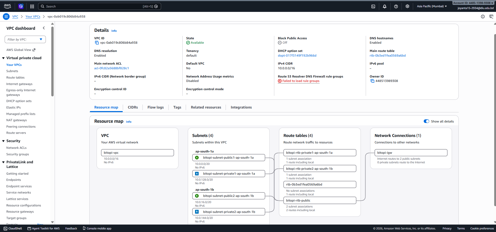

*Resource map: one VPC, four subnets, one public route table shared by both public subnets (with a route to `bitopi-igw`), one private route table per private subnet (no internet route).*

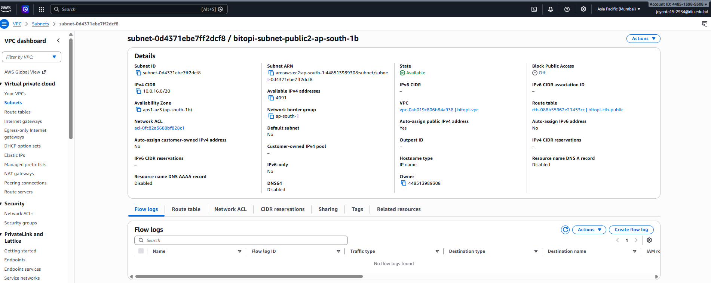

---

### Step 2 — Security groups (the firewalls)

**What:** three security groups, one per tier. Each one only trusts the tier directly in front of it.

**Why:** this is *defence in depth*. Even though the backend and database servers have public IPs, the firewall rules mean the only thing that can reach port 3000 is the load balancer, and the only thing that can reach port 3306 is a backend server. The rules reference **other security groups**, not IP addresses — so they keep working no matter how many instances the Auto Scaling Group launches or replaces.

**When you'd use it:** always. Chaining security groups by reference is the standard AWS pattern for multi-tier apps.

| Security group | ID | Inbound rules |
|---|---|---|
| `bitopi-alb-sg` | `sg-04c8272fbeeb0e769` | HTTP 80 from `0.0.0.0/0` · HTTPS 443 from `0.0.0.0/0` |
| `bitopi-backend-sg` | `sg-0029472c273fdd274` | **TCP 3000 from `bitopi-alb-sg`** · SSH 22 from admin |
| `bitopi-db-sg` | `sg-01883e3876cbf420d` | **MySQL 3306 from `bitopi-backend-sg`** · SSH 22 from admin |

Outbound on all three: default (all traffic). Security groups are **stateful**: when the backend opens a connection *into* the database, the reply is automatically allowed back out, so only inbound rules need to be written.

> **A note on SSH.** The SSH rules were left at `0.0.0.0/0` because the admin's public IP changes between networks and a "My IP" rule locked him out. Access still requires the `bitopi-key.pem` private key, so password-guessing is impossible. In production, SSH would be restricted to a bastion host or replaced with SSM Session Manager (not available in this account).

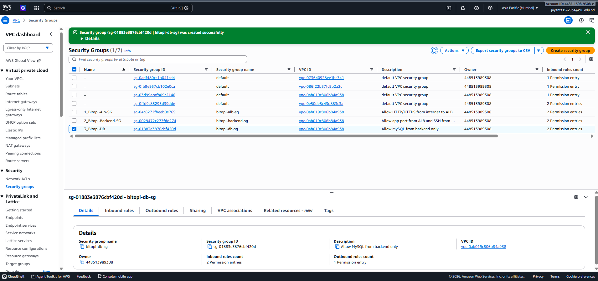
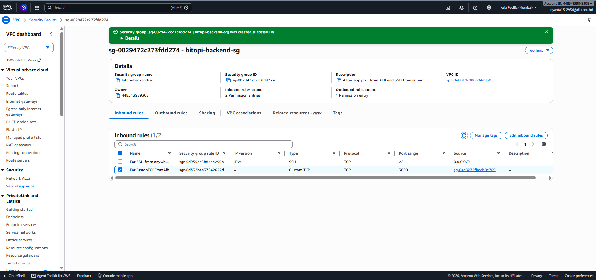
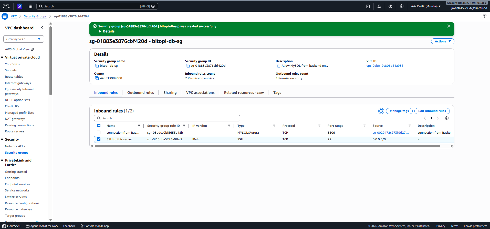

---

### Step 3 — Database tier (MySQL on EC2)

**What:** one `t3.micro` running Amazon Linux 2023. Its first-boot **user-data** script installs MariaDB, makes it listen on the network, creates the `appdb` database and an `appuser` account, and seeds two tables. Nobody ever logged in to set it up.

**Why:** the app needs a shared place to keep data. Every backend server — however many the Auto Scaling Group creates — connects to this one database, so all of them see the same data.

**When you'd use it:** self-hosting a database on EC2 is what you do when a managed service is unavailable (as here) or when you need something RDS doesn't offer. Otherwise, use RDS.

| Setting | Value |
|---|---|
| Name / ID | `bitopi-db-server` / `i-0496778ef511974dd` |
| AMI · type | Amazon Linux 2023 · `t3.micro` |
| Subnet | `bitopi-subnet-public1-ap-south-1a` (public IP enabled for package install) |
| Security group | `bitopi-db-sg` |
| Key pair | `bitopi-key` |
| **Private IP** | **`10.0.13.216`** — this is what the app connects to |
| Public IP | `13.233.34.184` (admin SSH only) |
| User-data | [`scripts/db-server-userdata.sh`](../scripts/db-server-userdata.sh) |

The script, in plain words:

```bash
dnf install -y mariadb105-server          # install MySQL-compatible server
systemctl enable --now mariadb            # start it now and on every boot
# make it listen on all interfaces (not just localhost)
printf '[mysqld]\nbind-address=0.0.0.0\n' > /etc/my.cnf.d/99-app.cnf
systemctl restart mariadb
mysql <<'SQL'                              # create database, user, tables, seed row
CREATE DATABASE IF NOT EXISTS appdb;
CREATE USER IF NOT EXISTS 'appuser'@'%' IDENTIFIED BY '...';
GRANT ALL PRIVILEGES ON appdb.* TO 'appuser'@'%';
...
SQL
```

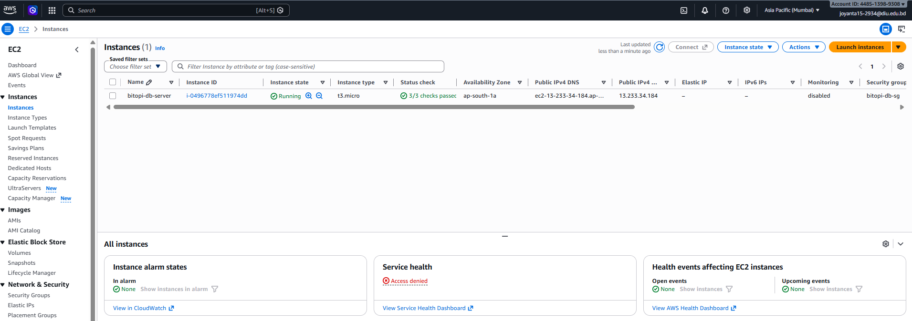
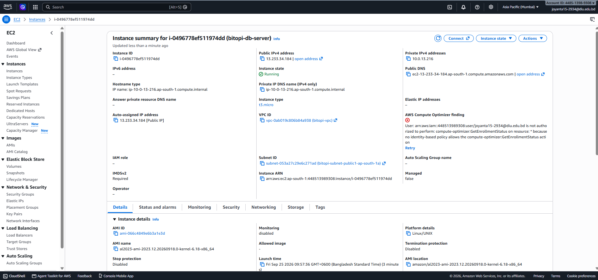

---

### Step 4 — Launch Template (the recipe for every app server)

**What:** `bitopi-app-lt` — a saved blueprint that says exactly how to build one backend server: which OS image, which size, which key, which firewall, and a first-boot script that installs and starts the app.

**Why:** the Auto Scaling Group must be able to create servers **without a human**. It can only do that if it has a recipe. Every instance stamped from this template is identical.

**When you'd use it:** any time more than one copy of a server will ever exist — Auto Scaling Groups, spot fleets, or simply "launch another one exactly like the last one".

| Setting | Value |
|---|---|
| Name / ID | `bitopi-app-lt` / `lt-072cb16544d51e361` (v1) |
| AMI · type | Amazon Linux 2023 (`ami-066c4849e6b3a1e3d`) · `t3.micro` |
| Key pair | `bitopi-key` |
| Security group | `bitopi-backend-sg` |
| Subnet | **not included** — the ASG decides, so it can spread across AZs |
| User-data | [`scripts/app-server-userdata.sh`](../scripts/app-server-userdata.sh) |

What the user-data does on every new server, in order:

1. `dnf install -y nodejs` — install Node.js.
2. Ask the **instance metadata service** for its own instance-ID and AZ (IMDSv2: get a token, then query `169.254.169.254`).
3. Write `/opt/app/app.js` and `package.json` ([`app/`](../app/)).
4. Write `/opt/app/.env` with `PORT=3000`, its instance-ID and AZ, and the database connection (`DB_HOST=10.0.13.216`, `appuser`, `appdb`, `3306`).
5. `npm install` — fetch `express` and `mysql2`.
6. Register a **systemd service** `bitopi-app` so the app starts on boot and restarts if it crashes.

The app itself ([`app/app.js`](../app/app.js)) serves two routes:

- `GET /health` → `200 {"status":"healthy", ...}`. **Deliberately shallow** — it only proves the process is alive. It does *not* touch the database, so a brief DB blip cannot make the load balancer mark the whole fleet unhealthy.
- `GET /` → an HTML page showing which instance answered, its AZ, whether the database is reachable, the seed row read from MySQL, and a visit counter that *writes* a row to MySQL on every load. One page proves all three tiers are talking.

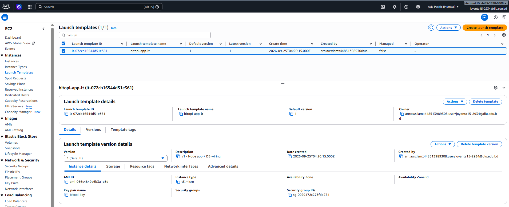

---

### Step 5 — Target Group and Application Load Balancer

**What:** the Target Group `bitopi-app-tg` is the ALB's *list of servers* plus the *health-check rule*. The ALB `bitopi-alb` is the public entry point that listens on port 80 and forwards to that group.

**Why:** users need **one** stable address while the servers behind it come and go. The ALB provides it, spreads traffic across every healthy server, and quietly stops sending traffic to any server that fails its health check.

**When you'd use it:** any web application with more than one server, or any application that must survive a server failure without users noticing.

| Target group `bitopi-app-tg` | |
|---|---|
| Target type · protocol : port | Instances · **HTTP : 3000** |
| VPC | `bitopi-vpc` |
| Health check | **HTTP `GET /health`**, success code `200` |
| Interval · timeout | 15 s · 5 s |
| Healthy · unhealthy threshold | 2 · 2 (so a server flips state after 30 s of consistent results) |
| Registered targets at creation | none — the ASG registers them |

| Load balancer `bitopi-alb` | |
|---|---|
| Type · scheme | Application · **Internet-facing** |
| Subnets | both **public** subnets (one node per AZ) |
| Security group | `bitopi-alb-sg` |
| Listener | **HTTP : 80 → forward to `bitopi-app-tg`** |
| DNS name | `bitopi-alb-1957667478.ap-south-1.elb.amazonaws.com` |

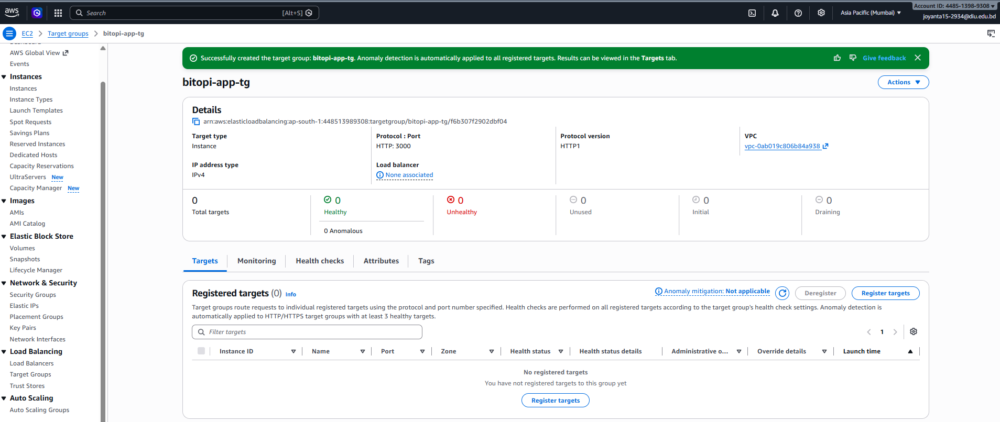
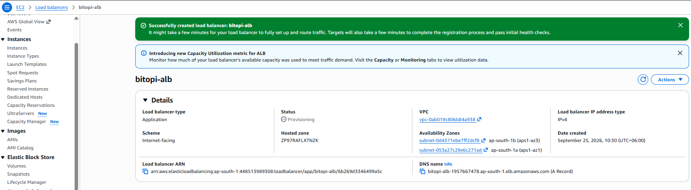
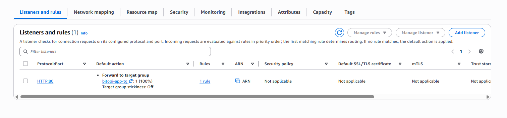

---

### Step 6 — Auto Scaling Group

**What:** `bitopi-app-asg` — the manager. It keeps the number of running app servers between **min 2** and **max 4**, launches them from the Launch Template into both public subnets, registers each one with the Target Group, and replaces any that become unhealthy.

**Why:** this single component delivers all three assignment goals. **High availability** — two servers in two AZs. **Self-healing** — it watches health and replaces failures. **Auto scaling** — with a policy attached (Step 8) it adds and removes servers on demand.

**When you'd use it:** whenever a stateless service needs to stay up and cope with variable load. Web/API backends are the classic case.

| Setting | Value |
|---|---|
| Launch template | `bitopi-app-lt`, version *Latest* |
| Subnets | `bitopi-subnet-public1-ap-south-1a` + `bitopi-subnet-public2-ap-south-1b` |
| Load balancing | attached to target group `bitopi-app-tg` |
| Health checks | EC2 **and** **Elastic Load Balancing** (so a failed `/health` counts as unhealthy, not just a stopped VM) |
| Health check grace period | 300 s — a new server gets 5 minutes to install Node and start before its health is judged |
| Capacity | **min 2 · desired 2 · max 4** |
| Tag | `Name = bitopi-app-server` (propagated to every instance) |

**Result:** two instances launched, one per AZ, and both passed the health check within ~4 minutes. Opening the ALB's DNS name in a browser served the app page with **Database: CONNECTED** — browser → ALB → EC2 → MySQL, all working. Refreshing the page shows different instance IDs as the ALB rotates between servers.

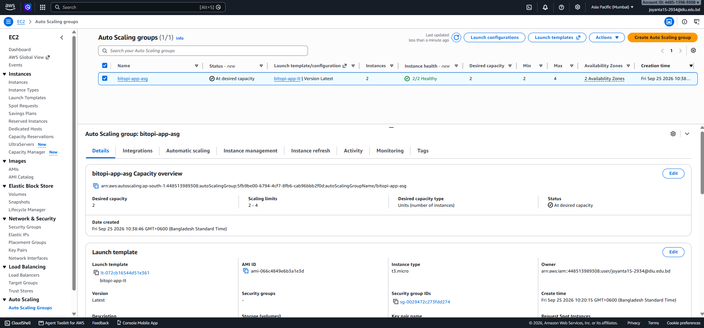
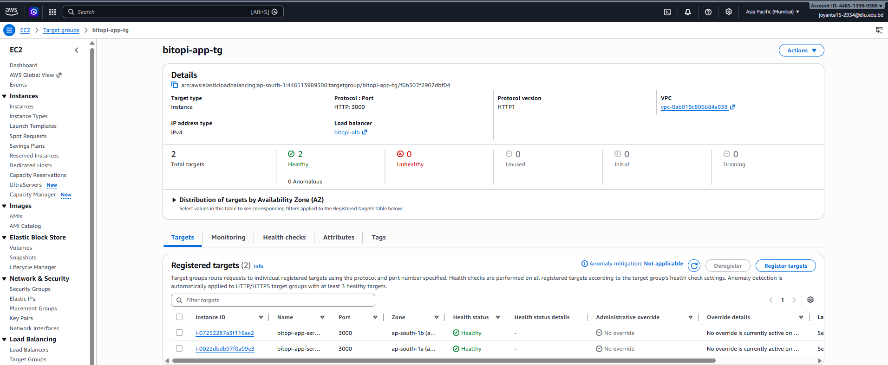
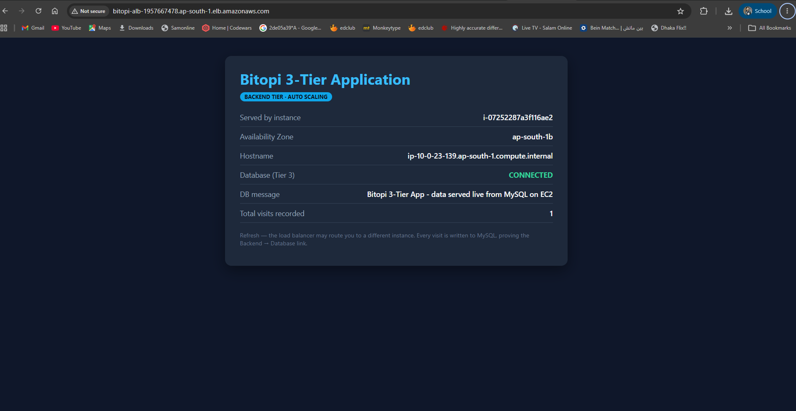

---

### Step 7 — Self-healing test

**Test:** with two healthy instances running, one (`i-0022dbdb97f0a99e3`, in `ap-south-1a`) was **terminated by hand** from the EC2 console — simulating a hardware failure or a crashed server.

**What happened, from the ASG activity log:**

| Time (UTC+6) | Event |
|---|---|
| 11:03:08 | *"Terminating EC2 instance i-0022dbdb97f0a99e3 … taken out of service in response to an EC2 health check … Waiting For ELB Connection Draining"* |
| **11:03:10** | *"Launching a new EC2 instance **i-0b762fab68c3abe53** … in response to an unhealthy instance needing to be replaced"* |
| ~11:06 | Target group back to **2 healthy** — the replacement placed in `ap-south-1a`, restoring the AZ balance |

**Two seconds** from detection to replacement. During the rebuild the app URL kept working, served by the surviving instance in `ap-south-1b` — **zero downtime**. The replacement has a **different instance ID**: it is a brand-new server built from the Launch Template, not a restart.

*Connection draining* means the ALB let in-flight requests to the dying server finish before cutting it off.

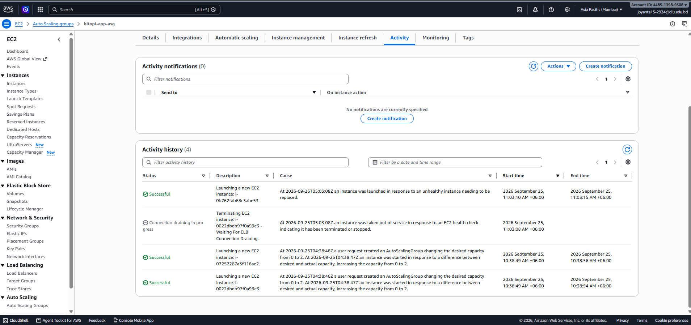
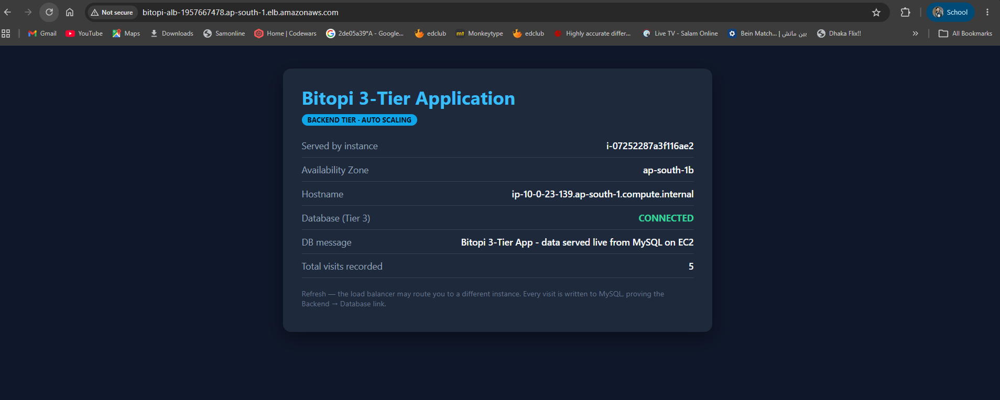
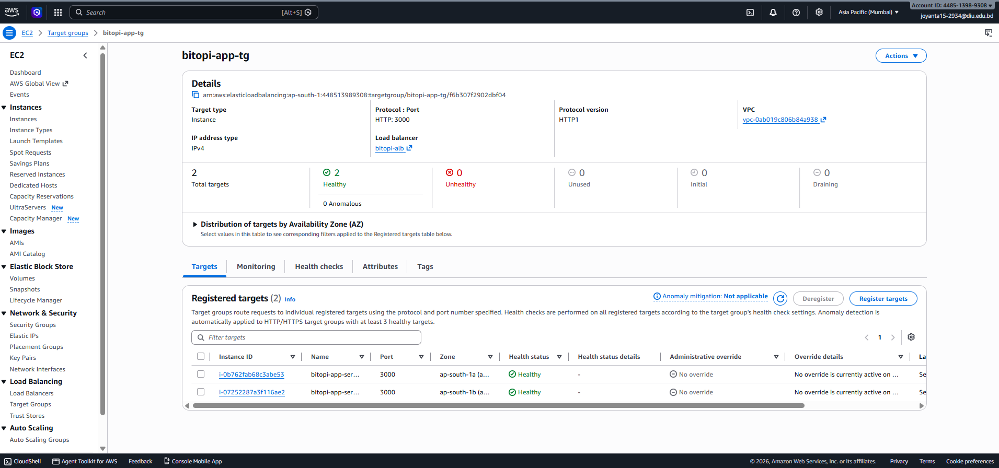

---

### Step 8 — Scaling policy and load test

**Policy:** `bitopi-cpu-target-tracking` — **Target tracking** on **Average CPU utilization = 30%**, instance warm-up 60 s, scale-in enabled.

**Why target tracking:** you give it one number and AWS derives everything else — it creates two CloudWatch alarms (`AlarmHigh`, `AlarmLow`) and works out how many instances keep the average near the target. It is the *thermostat* model. The alternative, **step scaling**, makes you write the rules yourself ("if CPU > 60% add 1; if > 80% add 2"). Target tracking is the recommended default for web backends.

**How the maths works** (this predicted the result exactly):

> desired = ceil( current instances × current metric ÷ target )
> = ceil( 2 × 50% ÷ 30% ) = ceil(3.33) = **4**

**Load generation:** SSH into a backend instance and pin every CPU core with a dependency-free loop that stops itself after 15 minutes:

```bash
for i in $(seq 1 $(nproc)); do timeout 900 bash -c 'while :; do :; done' & done
top -bn1 | head -5        # showed: 86.1 us, 13.9 sy, 0.0 id  → 100% busy
```

Stop early with `pkill -f "timeout 900"`.

**Scale-out**, from the activity log:

| Time | Event |
|---|---|
| ~11:27 | Load started on `i-07252287a3f116ae2` (`ip-10-0-23-139`) — 0.0% idle |
| **11:34:42** | *"monitor alarm TargetTracking-…-AlarmHigh in state ALARM triggered policy bitopi-cpu-target-tracking changing the desired capacity from 2 to 4"* — launched `i-0f33782fbae77fa57` and `i-0791db15f912ef398` |
| 11:35:47 | **4 instances InService, all Healthy**, two per AZ |

**Scale-in** (load stopped ~11:45; target tracking waits ~15 minutes of sustained low CPU before removing anything, to prevent "flapping"):

| Time | Event |
|---|---|
| **12:01:20** | *"AlarmLow in state ALARM … changing the desired capacity from 4 to 3"* — `i-07252287a3f116ae2` selected, connection draining |
| **12:01:40** | *"… from 3 to 2"* — `i-0b762fab68c3abe53` selected, connection draining |
| 12:04 | Desired 2; one instance left in **each** AZ (the ASG removed one from each zone, keeping the balance) |

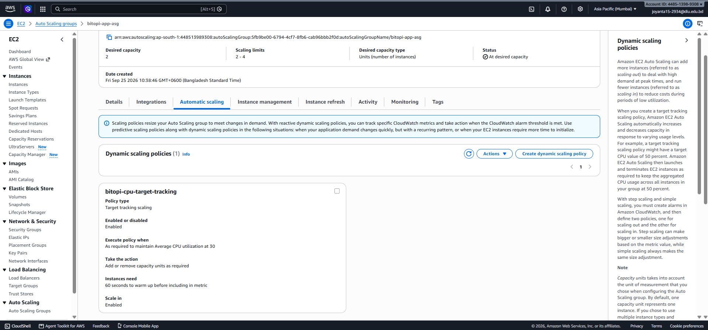
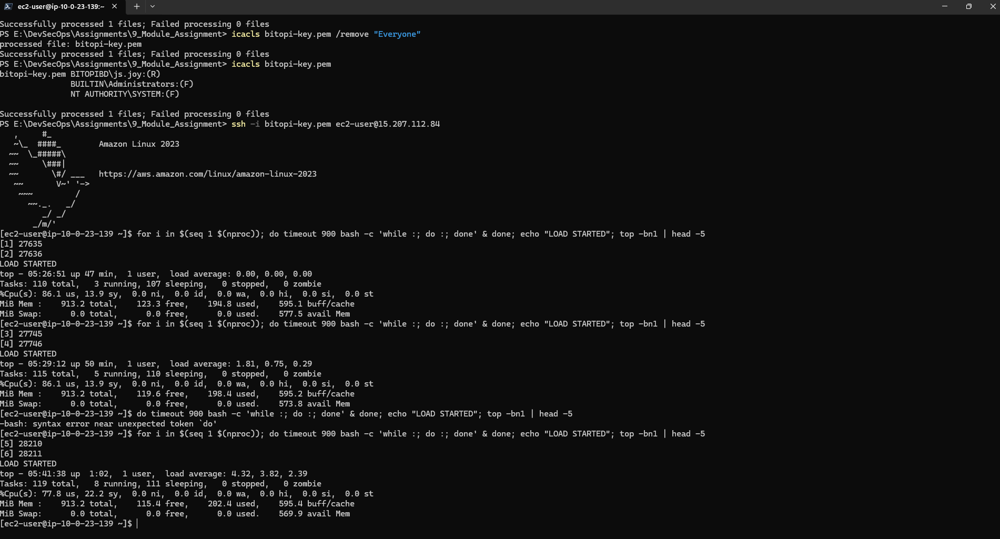
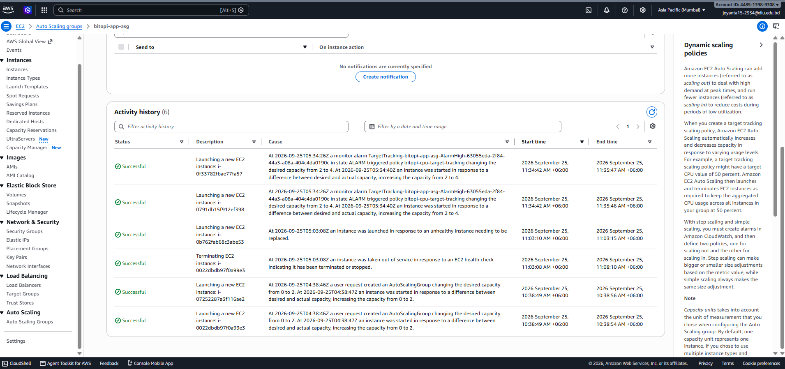
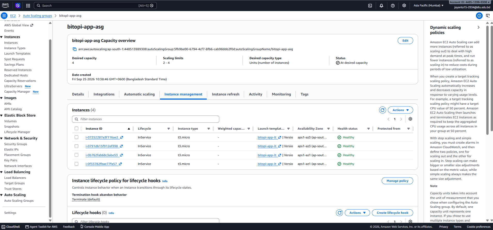
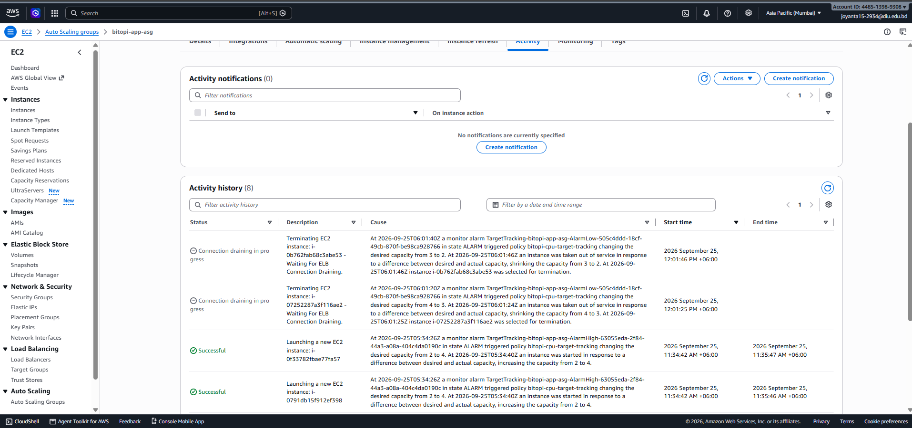
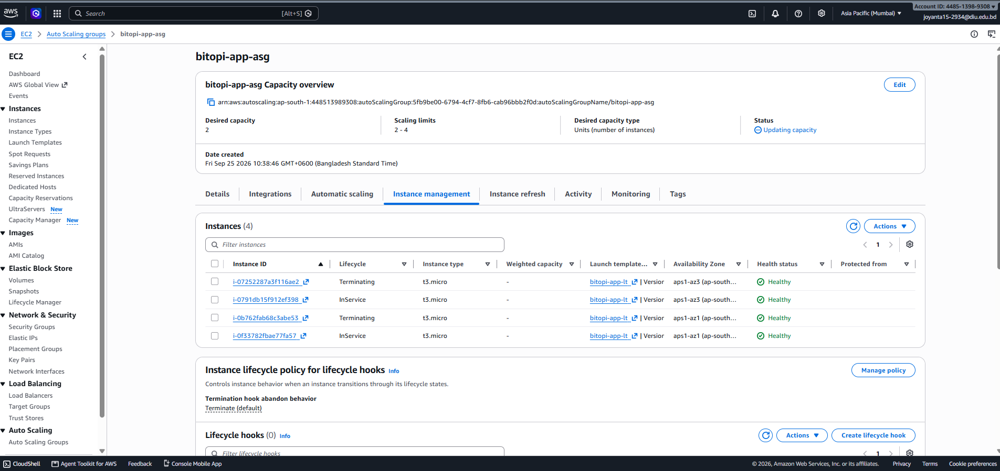

## 5. Health checks — the two layers explained

There are two different health checks and they do different jobs.

| | ALB / Target Group health check | Auto Scaling Group health check |
|---|---|---|
| **Question it asks** | "Should I send this server traffic *right now*?" | "Should this server be *replaced*?" |
| **How** | `GET /health` every 15 s; 2 consecutive failures → *unhealthy* | EC2 status checks **plus** the ELB result (we turned this on) |
| **Consequence** | Server is taken out of rotation; traffic goes to the others | Server is terminated and a new one launched from the template |
| **Safety valve** | — | 300 s grace period so a booting server isn't killed for being slow |

Turning on *ELB health checks* in the ASG is what links the two: an app that hangs (process alive, but `/health` not answering) fails the ALB check, the ASG hears about it, and the server is replaced. Without that setting the ASG would only replace servers whose VM died.

## 6. Submission checklist → evidence

| Required item | Where |
|---|---|
| Architecture diagram | `diagrams/part1_architecture.png` |
| Launch Template configuration | P1-07 |
| ALB & Target Group configuration | P1-09, P1-10, P1-11 |
| Auto Scaling Group configuration | P1-12 |
| Health check configuration | P1-09 (target group), P1-12 (ASG) |
| Security groups | P1-02, P1-03, P1-04 |
| Self-healing test evidence | P1-15, P1-16, P1-17 |
| Scaling policy configuration | P1-18 |
| Scale-out / scale-in evidence | P1-19 … P1-23 |
| Application running through the ALB | P1-14 |
| Short documentation | this file |

## 7. Resource inventory

| Resource | Name | ID / address |
|---|---|---|
| VPC | `bitopi-vpc` | `vpc-0ab019c806b84a938` · `10.0.0.0/16` |
| Internet gateway | `bitopi-igw` | — |
| Public subnets | `…public1-ap-south-1a` / `…public2-ap-south-1b` | `subnet-053a27c29e6c271ad` / `subnet-0d4371ebe7ff2dcf8` |
| Security groups | `bitopi-alb-sg` / `bitopi-backend-sg` / `bitopi-db-sg` | `sg-04c8272fbeeb0e769` / `sg-0029472c273fdd274` / `sg-01883e3876cbf420d` |
| Key pair | `bitopi-key` | `bitopi-key.pem` (never committed) |
| Database server | `bitopi-db-server` | `i-0496778ef511974dd` · private `10.0.13.216` |
| Launch template | `bitopi-app-lt` | `lt-072cb16544d51e361` |
| Target group | `bitopi-app-tg` | HTTP : 3000, `/health` |
| Load balancer | `bitopi-alb` | `bitopi-alb-1957667478.ap-south-1.elb.amazonaws.com` |
| Auto Scaling group | `bitopi-app-asg` | min 2 / desired 2 / max 4 |
| Scaling policy | `bitopi-cpu-target-tracking` | avg CPU 30 % |

## 8. Cleanup

The infrastructure is left running because **Part 2 (CI/CD) deploys onto this same Auto Scaling Group**. The cleanup checklist is in the final section of the Part 2 document.
