# Part 2 — CI/CD Pipeline for the Auto Scaling Backend

**Student:** Joyanta Sarker Joy · **Course:** Mastering DevOps, Batch 13 · **Region:** Asia Pacific (Mumbai) `ap-south-1`
**Repository:** `JsJoyBitopibd/-AWS-Auto-Scaling-CI-CD-for-3-Tier-Application-Part-1-Auto-Scaling-for-3-Tier-Applications`

## 1. Objective

Build a pipeline that takes a code change from `git push` all the way to the running Auto Scaling fleet with no manual deployment — and prove that (a) a brand-new server launched by the Auto Scaling Group receives the correct application version by itself, and (b) a new version can be released with a Blue/Green switch and rolled back.

## 2. Why this pipeline looks different from the assignment's wording

The assignment names **AWS CodePipeline + CodeBuild + CodeDeploy**. Those three services each require an **IAM service role**, and CodeDeploy additionally needs an **EC2 instance profile** attached to the Launch Template (`iam:PassRole`). The course account **cannot create IAM roles** (documented in Part 1, §3), and a check of the CodeDeploy and CodeBuild consoles confirmed no pre-existing roles were available to select.

So the pipeline was built with tools the account *can* use, keeping every stage the assignment asks for:

| Assignment stage | AWS-native tool it names | What this project uses | Why it is equivalent |
|---|---|---|---|
| **Source** | CodePipeline source (GitHub) | GitHub repository, branch `main` | same source, same trigger (push) |
| **Build + Test** | CodeBuild + `buildspec.yml` | GitHub Actions + `.github/workflows/ci-cd.yml` | hosted runner installs dependencies and runs the test suite; a failing test stops the pipeline |
| **Artifact** | S3 artifact bucket | GitHub Release asset `bitopi-app.zip` (+ workflow artifact) | versioned, immutable, downloadable over HTTPS |
| **Deploy** | CodeDeploy agent + `appspec.yml` | `deploy.sh` + a `systemd` timer on every instance, installed by the Launch Template | same "agent on the box pulls the bundle and restarts the app" model as CodeDeploy — but **pull**-based, so no AWS credentials are needed anywhere |
| **Blue/Green** | CodeDeploy Blue/Green | second Target Group + second Auto Scaling Group + ALB listener switch | this is literally what CodeDeploy does under the hood for EC2 Blue/Green |

The result needs **zero IAM roles, zero instance profiles, zero access keys**: nothing ever pushes *into* AWS. Servers reach *out* to GitHub over HTTPS (port 443), which the default security-group egress already allows.

## 3. Architecture

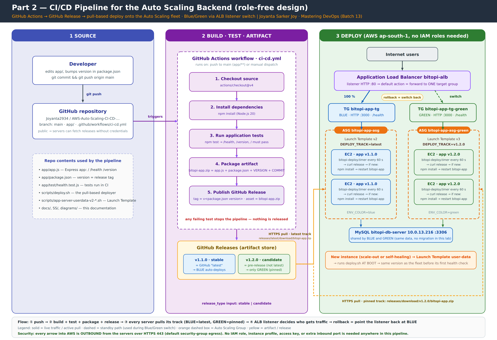

**The flow, in one paragraph.** A developer bumps `version` in `app/package.json` and pushes to `main`. GitHub Actions checks out the code, installs dependencies, runs the tests, zips the app together with a `VERSION` file and the commit hash, and publishes that zip as a **GitHub Release** tagged `v<version>`. On every backend server a `systemd` timer runs `deploy.sh` every 60 seconds; the script downloads the release for its track, compares the `VERSION` inside with the one running, and — only if different — unzips, `npm install`s and restarts the app. Because the Launch Template runs the same script **at first boot**, any server the Auto Scaling Group creates arrives on the current version before its first health check.

Two release types make Blue/Green possible:

| `release_type` | GitHub marks it | GitHub "latest" | Who deploys it |
|---|---|---|---|
| `stable` (default on push) | normal release | **yes** | the **Blue** fleet — `DEPLOY_TRACK=latest` |
| `candidate` (manual run) | **pre-release** | no | only a fleet pinned to that tag — **Green**, `DEPLOY_TRACK=v1.2.0` |

## 4. Repository contents used by the pipeline

| File | Role |
|---|---|
| [`app/app.js`](../app/app.js) | Express app: `/` (page), `/health` (liveness), `/version` (what is deployed). Reads its version from `package.json`, its colour from `ENV_COLOR` |
| [`app/package.json`](../app/package.json) | `version` → release tag; `npm test` → `node --test test/` |
| [`app/test/health.test.js`](../app/test/health.test.js) | 3 tests: `/health` is 200 + healthy; `/version` matches `package.json`; `/` renders even with no database |
| [`.github/workflows/ci-cd.yml`](../.github/workflows/ci-cd.yml) | the pipeline (Source → Build → Test → Package → Release) |
| [`scripts/deploy.sh`](../scripts/deploy.sh) | the pull-based deployer that runs on every instance |
| [`scripts/app-server-userdata-v2-blue.sh`](../scripts/app-server-userdata-v2-blue.sh) | Launch Template **v2** — installs the deployer, `ENV_COLOR=blue`, `DEPLOY_TRACK=latest` |
| [`scripts/app-server-userdata-v3-green.sh`](../scripts/app-server-userdata-v3-green.sh) | Launch Template **v3** — same, but `ENV_COLOR=green`, `DEPLOY_TRACK=v1.2.0` |

## 5. Build steps and evidence

---

### Step 1 — The pipeline: Source → Build → Test → Artifact → Release

**What:** `.github/workflows/ci-cd.yml`, triggered by any push to `main` that touches `app/`, or run manually with a `release_type` input.

**Why each stage exists:**

| Step in the workflow | Command | Purpose |
|---|---|---|
| Checkout source | `actions/checkout@v4` | get the code that was pushed |
| Set up Node.js 20 | `actions/setup-node@v4` | same runtime the servers use |
| Install dependencies | `npm install` | build the app |
| **Run application tests** | `npm test` | **gate** — any failure stops the run; nothing is released |
| Read version | `node -p "require('./package.json').version"` | the version *is* the release tag |
| **Package deployable artifact** | `zip bitopi-app.zip app.js package.json VERSION COMMIT` | the thing that gets deployed; `VERSION` lets servers detect change, `COMMIT` ties it to source |
| Upload artifact | `actions/upload-artifact@v4` | kept with the run for audit |
| **Publish GitHub Release** | `gh release create v<version> bitopi-app.zip [--prerelease]` | the store the servers pull from |

**Result — first run, on the first push:** the job *Build → Test → Package → Release* succeeded in **13 s**. All **3 tests passed** (`# pass 3 / # fail 0`). The artifact contained 4 files (5,308 bytes). Release **v1.1.0 (stable)** was published.

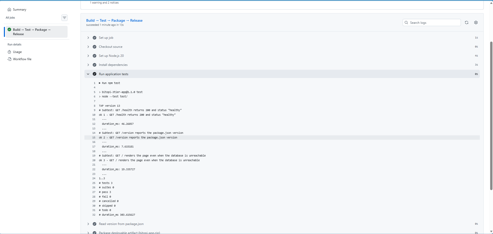
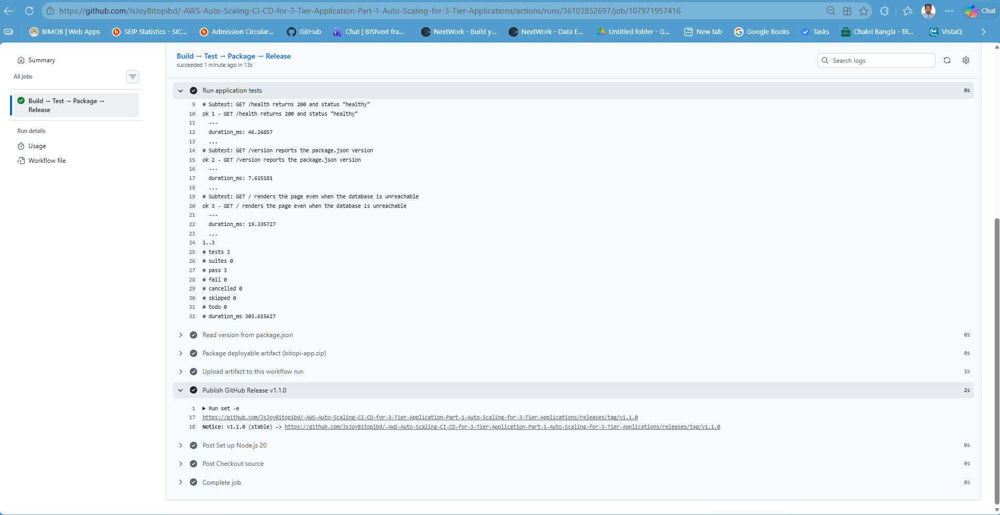
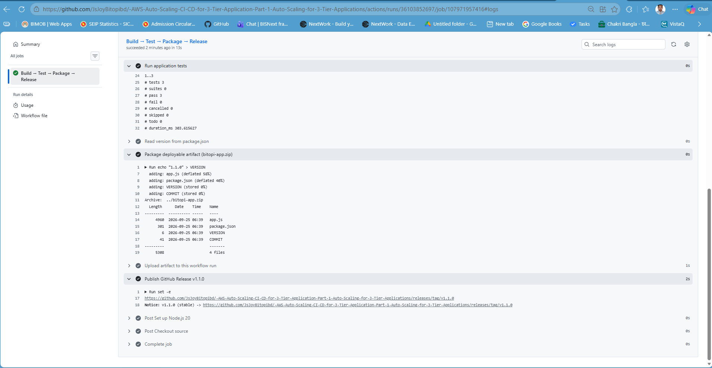
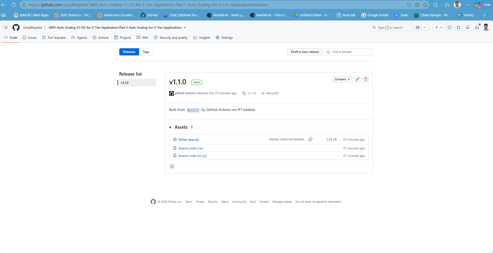

---

### Step 2 — The deployer on every server (Launch Template v2)

**What:** a new Launch Template version whose user-data no longer contains the application. Instead it installs:

- `/opt/deploy/deploy.sh` — the deployer (below)
- `/opt/deploy/deploy.env` — `DEPLOY_TRACK=latest`
- `bitopi-deploy.service` + `bitopi-deploy.timer` — runs the deployer 45 s after boot and every 60 s after that
- `/opt/app/.env` — instance ID, AZ, `ENV_COLOR`, database connection (**not** part of the release zip, so a deploy never overwrites configuration)

…and then runs the deployer **once immediately**, so the app is installed before the ALB's first health check.

**The deployer, in plain words** ([`scripts/deploy.sh`](../scripts/deploy.sh)):

```bash
TRACK="${DEPLOY_TRACK:-latest}"                       # "latest" or a tag such as v1.2.0
URL=".../releases/latest/download/bitopi-app.zip"     # or .../releases/download/$TRACK/bitopi-app.zip
curl -fsSL -o app.zip "$URL" || exit 0                # can't reach GitHub? do nothing, try again in 60 s
unzip -q -o app.zip -d tmp
NEW=$(cat tmp/VERSION); CUR=$(cat /opt/app/VERSION || echo none)
[ "$NEW" = "$CUR" ] && exit 0                         # already running this version → nothing to do
cp -r tmp/. /opt/app/ && cd /opt/app && npm install --omit=dev
systemctl restart bitopi-app                          # ~1 s; /health is shallow so the ALB never notices
echo "deployed $NEW (commit $(cat /opt/app/COMMIT))" >> /var/log/bitopi-deploy.log
```

**Why a timer instead of a push:** a push-based deploy (CodeDeploy, SSH from a runner) needs something outside the VPC to hold credentials for the servers. A pull needs nothing: the server already has outbound internet, and GitHub Releases are public. It also means **new servers deploy themselves** (Step 4) with no extra machinery.

**Rolling the fleet onto v2 — Instance Refresh.** The two running servers still had the old v1 recipe, so the Auto Scaling Group's *Instance refresh* replaced them one at a time (rolling strategy, 120 s warm-up) — the ALB kept serving throughout.

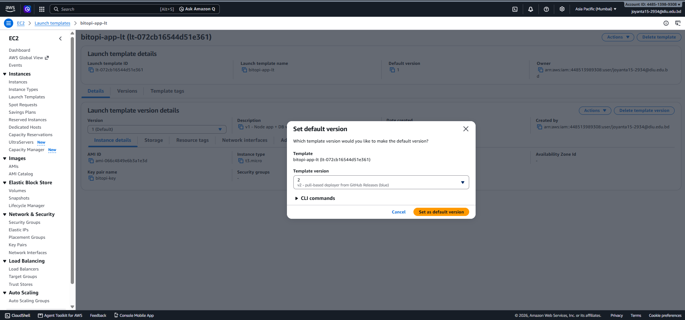
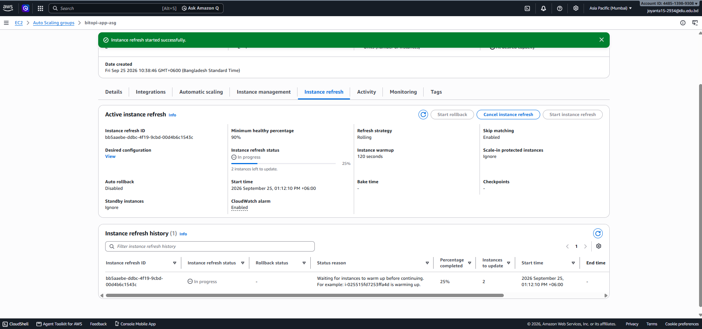

---

### Step 3 — Verify the deployed application

After the refresh, the ALB served **v1.1.0** from a brand-new instance (`i-09a53754f7dfda27b`), environment **blue**, database **CONNECTED** — the page footer reads *"Deployed by GitHub Actions → GitHub Release → pull-based deployer"*. `/version` confirms it as JSON.

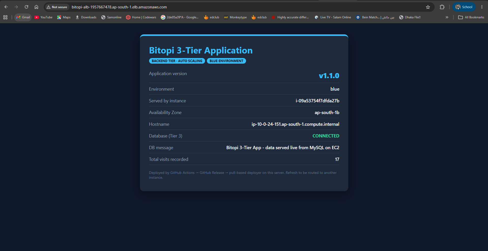
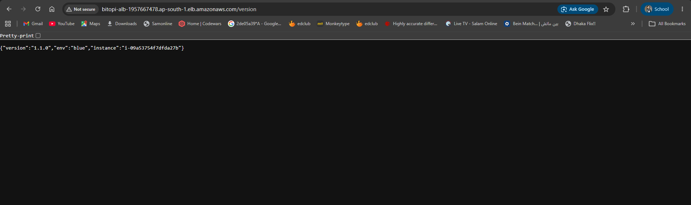

---

### Step 4 — Automatic deployment: push a change, touch nothing in AWS

**Test:** bump `package.json` to **1.1.1**, add one visible line to the page, `git push`. No AWS console action of any kind.

| Time (UTC) | What happened | Where |
|---|---|---|
| ~07:19 | push → Actions run → tests pass → **Release v1.1.1 (stable)** | GitHub |
| **07:20:36** | `[latest] deploying 1.1.0 -> 1.1.1` | `/var/log/bitopi-deploy.log` on `i-09a53754f7dfda27b` |
| **07:20:37** | `[latest] deployed 1.1.1 (commit 15b3fbb64e…)` | same |
| ~07:21 | second instance picks it up on its own next tick | — |

The commit hash in the server log is the exact commit that was pushed. The page now shows **v1.1.1** and the yellow *"What's new in v1.1.1: this line reached the server through automatic pull-based deployment — no AWS console action was taken."* Deploy-to-live on the whole fleet: **under two minutes from `git push`, one second per server once its timer fires.**

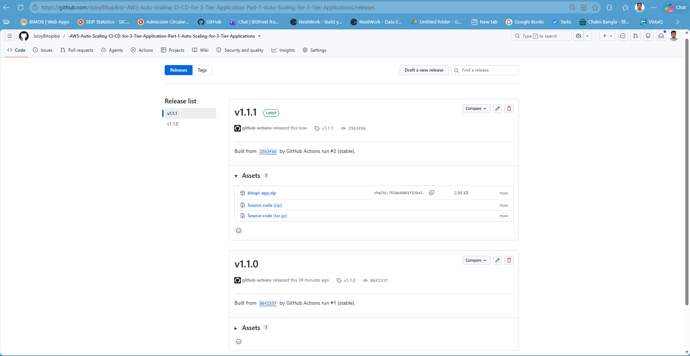

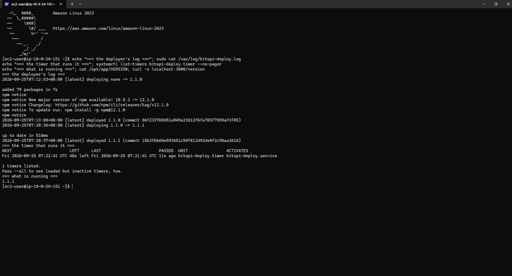

The log also shows the boot-time deploy (`deploying none -> 1.1.0` at 07:12:53, seconds after the instance started at 07:12:17) and the timer's next scheduled run — the entire mechanism in one screen.

---

### Step 5 — Auto-deploy to a new Auto Scaling instance

**Test:** ASG desired capacity **2 → 3**. The ASG launched `i-066f5aa10f6c4556a` in `ap-south-1b`.

**Result:** within ~3 minutes the target group showed **3 healthy** targets including the new one. A target can only become *healthy* if the ALB gets `200` from `GET /health` — which means the application was installed and running. Nobody deployed anything to it: the Launch Template's first-boot run of `deploy.sh` fetched **the current release (v1.1.1)** directly, skipping 1.1.0 entirely. Twelve consecutive requests to `/version` through the ALB all returned `"version":"1.1.1"`. Desired capacity was then returned to 2.

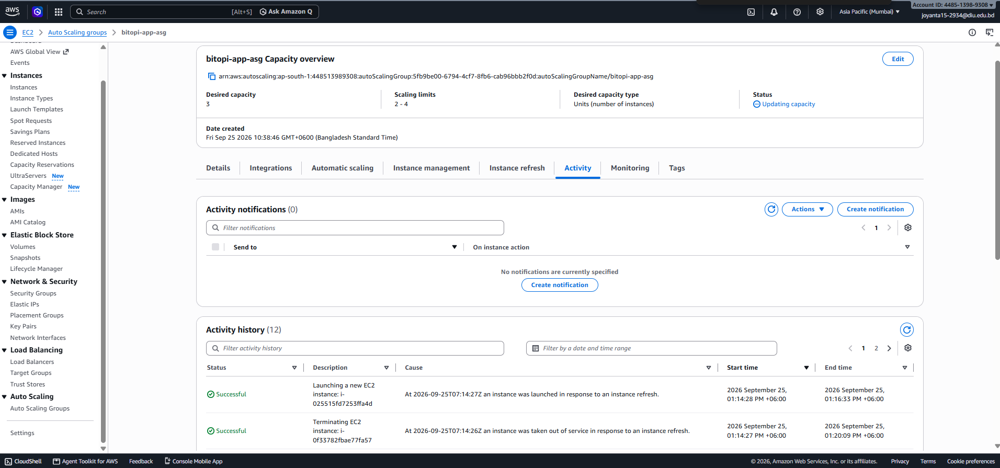
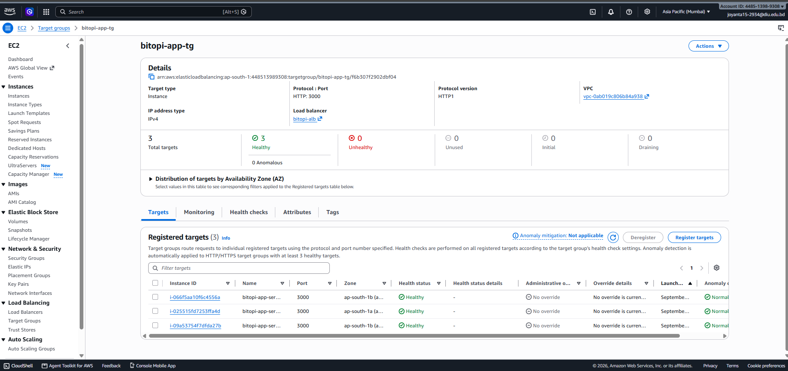
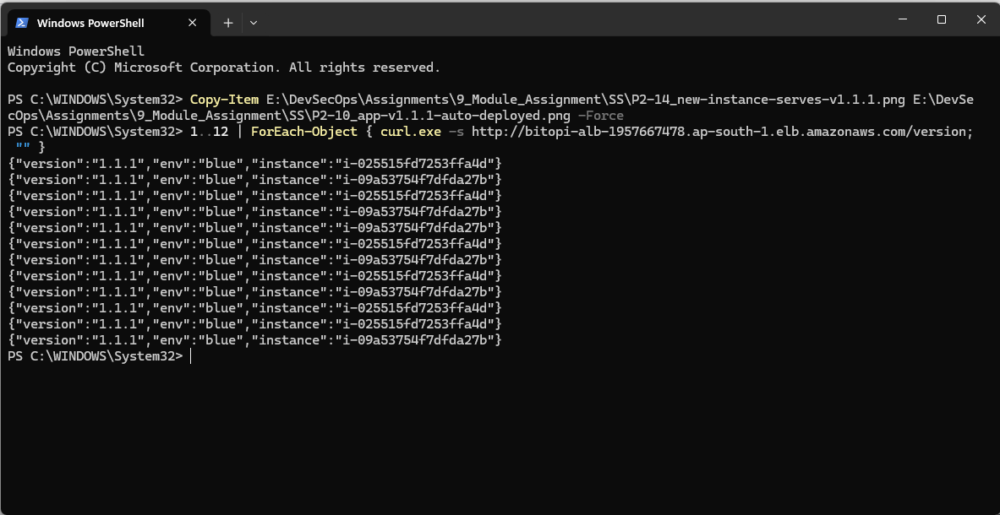
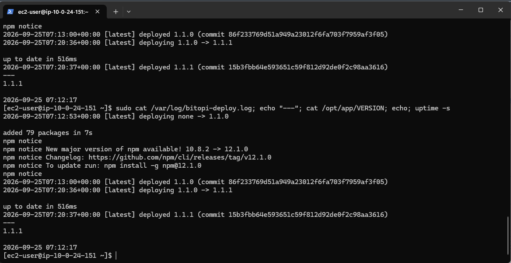

This is the property that ties the pipeline to the Auto Scaling Group: **scale-out at 3 a.m. and self-healing after a crash both produce servers on the right version**, because the template only knows *how to fetch*, never *what*.

---

### Step 6 — Blue/Green deployment: design and preparation

> **Status: designed, prepared, and ready to execute; the live switch and rollback were not run because the course account's servers are reclaimed after a short window.** Everything needed is in the repository; the runbook in §7 executes it in ~15 minutes on a rebuilt Part 1 stack.

**Design.**

```
                         ┌── listener :80 default action ──┐
   Internet ──▶  bitopi-alb                                 │  (exactly one of these at a time)
                         │                                  ▼
                         ├──▶ TG bitopi-app-tg        ──▶ ASG bitopi-app-asg        (BLUE,  LT v2, DEPLOY_TRACK=latest → v1.1.1)
                         └──▶ TG bitopi-app-tg-green  ──▶ ASG bitopi-app-asg-green  (GREEN, LT v3, DEPLOY_TRACK=v1.2.0)
                                                            both fleets share the same MySQL server
```

| Element | Blue | Green |
|---|---|---|
| Target group | `bitopi-app-tg` | `bitopi-app-tg-green` (identical settings, `/health`) |
| Auto Scaling Group | `bitopi-app-asg` (min 2 / max 4) | `bitopi-app-asg-green` (min 1 / max 2 for the lab) |
| Launch Template | `bitopi-app-lt` **v2** (default) | `bitopi-app-lt` **v3** — [`app-server-userdata-v3-green.sh`](../scripts/app-server-userdata-v3-green.sh) |
| Release track | `latest` (stable releases only) | pinned `v1.2.0` (a **candidate / pre-release**) |
| Page badge | BLUE ENVIRONMENT, blue accent | GREEN ENVIRONMENT, green accent |

**How the steps of the assignment map:**

1. **Deploy a new version to Green.** Push `v1.2.0` on a release branch; run the workflow with `release_type = candidate`. GitHub publishes it as a *pre-release*, so Blue's `latest` track ignores it. Create LT v3 + the green target group + the green ASG; its servers boot straight onto v1.2.0.
2. **Perform health checks.** The green target group's own `/health` checks must show every green target *healthy* before any traffic moves. Optionally add a temporary listener on port 8080 → green to browse it directly.
3. **Switch production traffic.** ALB → listener `HTTP:80` → *Edit default action* → forward to `bitopi-app-tg-green` (100 %). Users now get v1.2.0. Blue keeps running untouched.
4. **Rollback.** Edit the same listener → forward to `bitopi-app-tg` again. Users are back on v1.1.1 within a second. Nothing had to be redeployed, because Blue was never changed — that is the whole point of Blue/Green versus a rolling update.

**Two safeguards worth noting.** *(a)* Blue's ASG must reference Launch Template version **Default** (= v2), not *Latest* — otherwise creating v3 would make Blue launch green servers. *(b)* The candidate must never be a *stable* release while Green is being tested, or Blue would auto-pull it. The workflow's `release_type` input enforces this.

**Prepared artifacts:** `app/package.json` at `1.2.0` with the Green-aware page (branch `release/v1.2.0`); `scripts/app-server-userdata-v3-green.sh`; the `candidate` path in the workflow.

## 6. Submission checklist → evidence

| Required item | Where |
|---|---|
| CI/CD architecture diagram | `diagrams/part2_cicd_architecture.png` |
| Pipeline configuration | `.github/workflows/ci-cd.yml`; P2-01, P2-02 |
| Build configuration | workflow steps *Install dependencies*, *Run application tests*; P2-01 |
| Deployment configuration | `scripts/deploy.sh`, `scripts/app-server-userdata-v2-blue.sh`; P2-05, P2-06 |
| Successful deployment evidence | P2-07, P2-08, P2-09, P2-10, P2-11 |
| New Auto Scaling instance deployment evidence | P2-12, P2-13, P2-14, P2-15 |
| Blue/Green deployment design | §5 Step 6, diagram, `app-server-userdata-v3-green.sh`, workflow `candidate` input |
| Rollback test evidence | **pending** — runbook in §7 |
| Final documentation | this file + `README.md` + `docs/how-servers-communicate.md` |

## 7. Runbook — finishing Blue/Green on a rebuilt stack (~15 min after Part 1 exists)

Use this if the account has reclaimed the servers. First run the read-only Terraform audit in [`terraform/`](../terraform/README.md) to learn exactly what is still there (it prints PRESENT/MISSING per resource, the DB server's private IP and the ALB URL). Then rebuild only what it reports missing — Part 1 first (VPC → security groups → DB server → LT v1 → TG → ALB → ASG; see Part 1 doc), then LT v2 + instance refresh (Step 2 above), then:

1. **Candidate release.** `git checkout release/v1.2.0` (or create it and bump `package.json` to `1.2.0`), push. GitHub → Actions → *CI/CD - build, test, release* → **Run workflow** → branch `release/v1.2.0`, `release_type` **candidate**. Confirm *Releases* shows **v1.2.0 Pre-release** and **v1.1.1 Latest**. 📸
2. **Protect Blue.** ASG `bitopi-app-asg` → Edit → Launch template version **Default**.
3. **Green target group.** `bitopi-app-tg-green`, HTTP 3000, health `/health`. 📸
4. **LT v3.** Modify `bitopi-app-lt` → new version, source v2, user-data = `scripts/app-server-userdata-v3-green.sh` (check `DB_HOST` matches the rebuilt DB server's private IP). Do **not** set as default. 📸
5. **Green ASG.** `bitopi-app-asg-green`, LT version 3, both public subnets, attach `bitopi-app-tg-green`, ELB health checks, min 1 / desired 1 / max 2. Wait until the green target is **healthy**. 📸
6. **Switch.** ALB → Listeners → `HTTP:80` → Edit default action → `bitopi-app-tg-green`. Browse the ALB → **v1.2.0 GREEN**. 📸
7. **Rollback.** Same listener → default action → `bitopi-app-tg`. Browse → **v1.1.1 BLUE**. 📸
8. Delete `bitopi-app-asg-green` and `bitopi-app-tg-green` when done.

## 8. Cleanup checklist (avoid charges)

Delete in this order (each step waits for the previous to finish):

1. Auto Scaling Groups `bitopi-app-asg-green` (if created) and `bitopi-app-asg` — set desired 0, then delete
2. Load balancer `bitopi-alb`, then target groups `bitopi-app-tg`, `bitopi-app-tg-green`
3. EC2 instance `bitopi-db-server`
4. Launch template `bitopi-app-lt` (all versions)
5. Key pair `bitopi-key`
6. Security groups `bitopi-db-sg`, `bitopi-backend-sg`, `bitopi-alb-sg` (in that order — each is referenced by the previous)
7. VPC `bitopi-vpc` (deletes its subnets, route tables and internet gateway)

The GitHub repository, releases and workflow cost nothing and stay.

## 9. Verifying the whole stack at any time — the Terraform audit

Because the course account reclaims servers, "is everything still working?" is a question that comes up every time work resumes. Instead of clicking through six console pages, the repository carries a **read-only Terraform program** in [`terraform/`](../terraform/README.md) that answers it in one command.

**What it is.** A Terraform configuration with *no* `resource` blocks — only lookups (`data` sources) and `check` blocks. `terraform apply` therefore cannot create, change or delete anything; it can only describe. It needs the same `Describe*` permissions the console already uses.

**What it reports.** One line per resource — VPC, the 4 subnets, the 3 security groups, key pair, DB server, launch template (and whether version 2 with the deployer exists), target group (port 3000, `/health`), ALB, Auto Scaling Group, and the optional green pair — as `PRESENT` or `MISSING`, plus the values needed to continue: the DB server's private IP (= `DB_HOST` in the user-data), the ALB URL, the ASG's min/desired/max and launch-template version, and **which target group the `:80` listener is forwarding to** (`bitopi-app-tg` = blue, `bitopi-app-tg-green` = green). That last value is direct evidence for the Blue/Green switch and the rollback.

**How to run it** (PowerShell, once Terraform is installed and an access key is in the environment — full step-by-step in `terraform/README.md`):

```powershell
cd E:\DevSecOps\Assignments\9_Module_Assignment\terraform
terraform init
terraform apply -auto-approve
terraform output audit_summary
```

**How to read it.** Warnings named `check "<resource>"` mean that resource is missing or mis-configured (the message names the Part/Step that rebuilds it); the `audit_summary` box lists `PRESENT`/`MISSING` for everything else. No warnings and every line `PRESENT` = the stack is complete. The only warning that is *expected* before the Blue/Green step is `target_group_green_optional`.

**Where it fits in the workflow.**

| When | Command | Expected |
|---|---|---|
| Resuming work after the servers were reclaimed | `terraform apply -auto-approve` | tells you exactly what to rebuild by hand (§7) |
| After rebuilding | same | everything `PRESENT`, only the green warning left |
| After the Blue/Green switch | `terraform output listener_forwards_to` | `bitopi-app-tg-green` |
| After the rollback | same | `bitopi-app-tg` |

Evidence: `SS/TF-01-terraform-audit-before.png` (state found on resuming), `SS/TF-02-terraform-audit-after.png` (all present).
